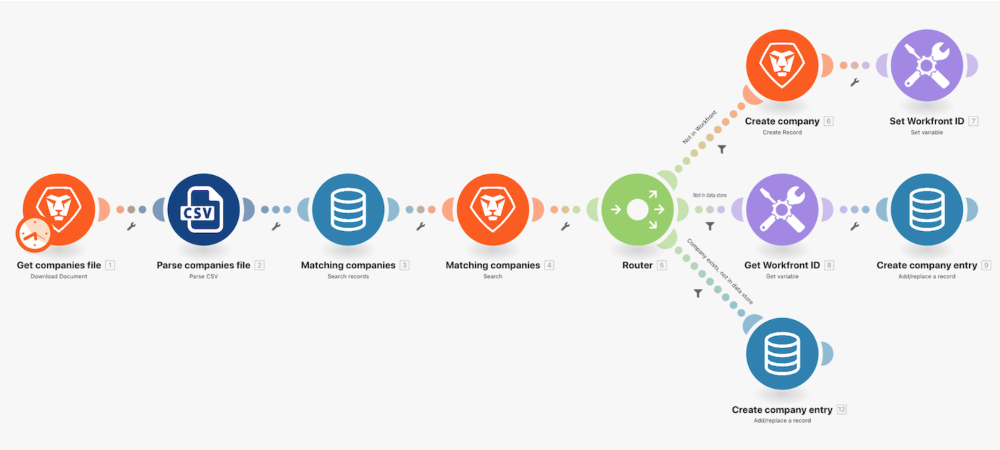

# Data stores walkthrough

## Overview

In this exercise we’re using a data store to synchronize company names between a list of companies and Workfront.

This is one part of a one-directional synchronization of companies in Workfront and some other system. For now, it will only sync between a CSV file and Workfront. But it will also maintain a table in a data store that will keep track of the Workfront ID (WFID) and the company ID in the CSV file (CID) for each company. This will allow us to make this a bi-directional synchronization at some point in the future.

## Data stores walkthrough

Workfront recommends watching the exercise walkthrough video before trying to recreate the exercise in your own environment.

>[!VIDEO](https://video.tv.adobe.com/v/335296/?quality=12)

>[!TIP]
>
>For step-by-step instructions on completing the walkthrough, download the .
**Disclaimer**: The Adobe Workfront Fusion activity book contains a few links to Workfront One, which do not work. This will be updated soon.

## Final note

Now that you’ve finished learning about data structures and data stores, you may be asking yourself, “When should you use them?” 

Data structures are most commonly used for serializing or parsing data formats such as JSON, XML, CSV, and others. Data structures give you the ability to control the structure of your data and even validate data. The most common reason you use a data structure is to create valid data to send to an API that expects JSON or XML. In these cases, you’ll want to use either the JSON or XML app along with your data structure to make sure data is in the correct format. 

Data stores should only be used to store persistent data that needs to be accessed by more than one scenario execution. For example, you may store metadata about the last record processed for advanced use cases requiring precise control over processing.  

Data stores are not designed to be used as a data warehouse or logging. Data stores are not accessible outside of Workfront Fusion and most interactions with data stores are through a Workfront Fusion scenario. Consequently, it’s not possible to connect a data store to an analytics or reporting tool that would be expected for data warehouse and logging use cases. Workfront Fusion’s role in use cases like these would be to populate a system appropriate for organizing and storing data (e.g. SQL, MariaDB).

## Want to learn more? We recommend the following:

