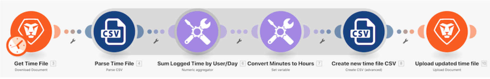

# Data structures walkthrough

## Overview

Open a CSV file that contains a list of time entries. These time entries are for minutes logged throughout certain days by multiple users. The goal is to take this information and produce a new CSV that shows the total time, in hours, logged by each user, each day.

## Data structures walkthrough

Workfront recommends watching the exercise walkthrough video before trying to recreate the exercise in your own environment.

>[!VIDEO](https://video.tv.adobe.com/v/335294/?quality=12)

>[!TIP]
>
>For step-by-step instructions on completing the walkthrough, download the .
**Disclaimer**: The Adobe Workfront Fusion activity book contains a few links to Workfront One, which do not work. This will be updated soon.

## Want to learn more? We recommend the following:

