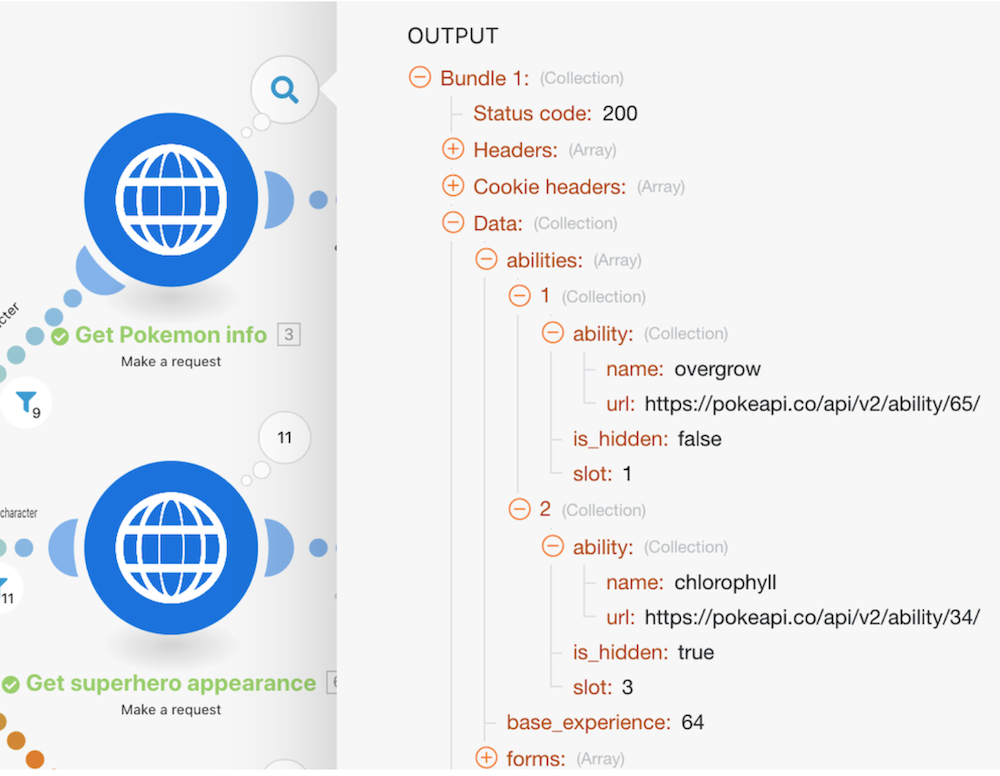

# Arrays walkthrough

## Overview

Review previous walkthrough exercises where simple and complex arrays were used. We'll review how we found these and how to utilize the information using array functions if necessary.

## Arrays walkthrough

Workfront recommends watching the exercise walkthrough video before trying to recreate the exercise in your own environment.

>[!VIDEO](https://video.tv.adobe.com/v/335299/?quality=12)

## Want to learn more? We recommend the following:

[Workfront Fusion documentation](https://experienceleague.adobe.com/docs/workfront/using/adobe-workfront-fusion/workfront-fusion-2.html?lang=en)

