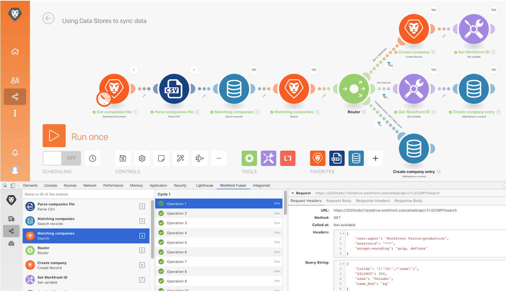

# Dev tool walkthrough

## Overview

Install and use the different areas in the Workfront Dev Tool to take a deeper dive into requests/responses made and advanced scenario design tricks.

## Dev tool walkthrough

Workfront recommends watching the exercise walkthrough video before trying to recreate the exercise in your own environment.

>[!VIDEO](https://video.tv.adobe.com/v/335303/?quality=12)

>[!TIP]
>
>For step-by-step instructions on completing the walkthrough, go to the [Dev tool walkthrough](https://experienceleague.adobe.com/docs/workfront-learn/tutorials-workfront/fusion/exercises/devtool.html?lang=en) exercise.

## Download the Dev tool

The Dev Tool has a number of advanced features that improve your ability to understand and troubleshooting scenarios. Download the “workfront-fusion-devtool.zip” document found in the Fusion Exercise Files folder in your test drive.

## Want to learn more? We recommend the following:

[Workfront Fusion documentation](https://experienceleague.adobe.com/docs/workfront/using/adobe-workfront-fusion/workfront-fusion-2.html?lang=en)
