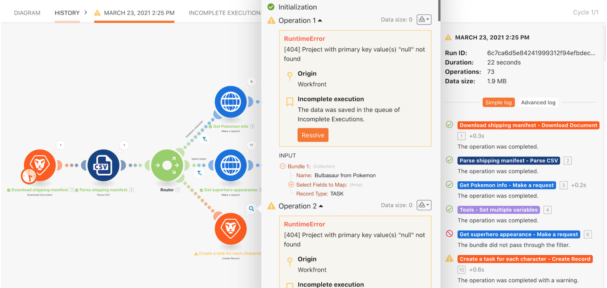

# Incomplete executions walkthrough

## Overview

Learn the useful habit of storing incomplete executions and understand the value provided when re-running bundles after evaluating and correcting errors.

## Incomplete executions walkthrough

Workfront recommends watching the exercise walkthrough video before trying to recreate the exercise in your own environment.

>[!VIDEO](https://video.tv.adobe.com/v/335308/?quality=12)

## Want to learn more? We recommend the following:

[Workfront Fusion documentation](https://experienceleague.adobe.com/docs/workfront/using/adobe-workfront-fusion/workfront-fusion-2.html?lang=en)
