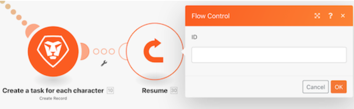
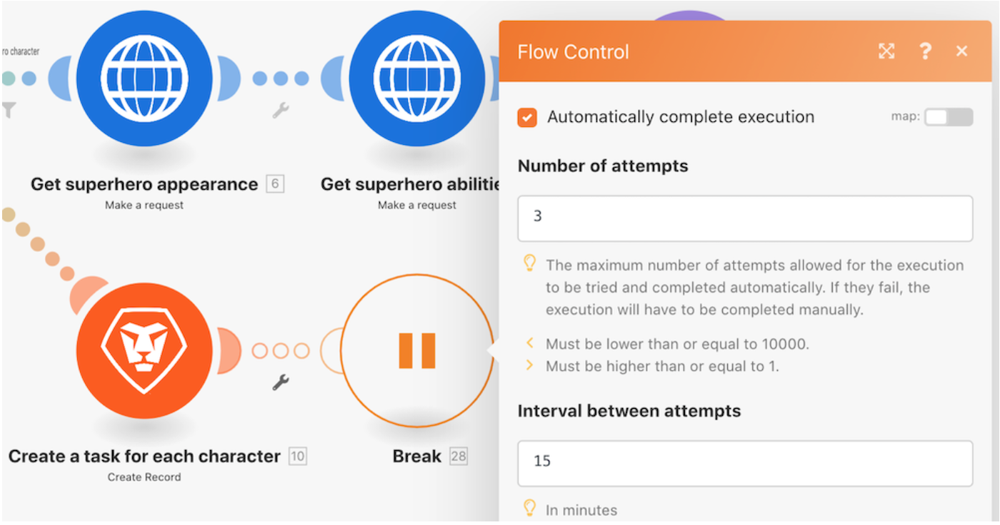
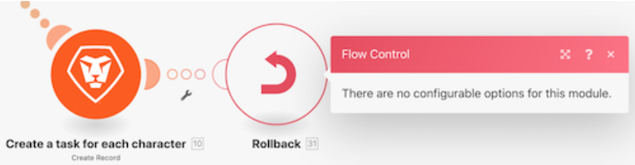
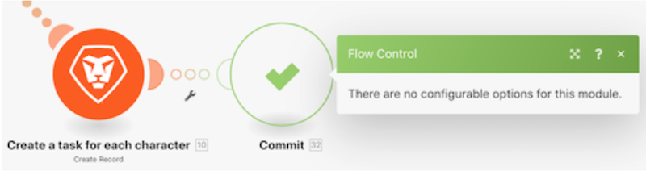

# Understand error handling directives

In this video, you will learn:

* The three error handler directives that allow execution to continue
* The two error handler directives that stop the execution

>[!VIDEO](https://video.tv.adobe.com/v/335305/?quality=12)

## Directives — Scenario continues

### Resume

* A substitute output is specified and supplied to the module that encounters an error.
* The subsequent modules are processed.
* The scenario execution status is marked as "success."

### Break

* The state of the scenario execution is stored in the queue of incomplete executions where the error can be resolved manually. There are, however, some exceptions which are mentioned here.
* The subsequent modules are not processed.
* If there are unprocessed bundles, the scenario execution continues normally.
* The scenario execution status is marked as "warning."

### Ignore

* The error is ignored and the subsequent modules are not processed. 
* If there are unprocessed bundles, the scenario execution continues normally.
* The scenario execution status is marked as "success."

## Directives — Scenario stops

### Rollback

* Scenario execution is stopped immediately and a rollback phase is started on all the modules in an attempt to revert them all to their initial state.
* The subsequent modules are not processed.
* Barring a few error types, the scenario is deactivated after the "number of consecutive errors" specified under Scenario settings.
* The scenario execution status is marked as "error."

>[!NOTE]
>
>This is the default behavior if no error handler route is attached to the module and the "Allow Storing Incomplete Executions" setting under Scenario settings is not checked.

### Commit

* The error is ignored and the subsequent modules are not processed. 
* If there are unprocessed bundles, the scenario execution continues normally.
* The scenario execution status is marked as "success."

