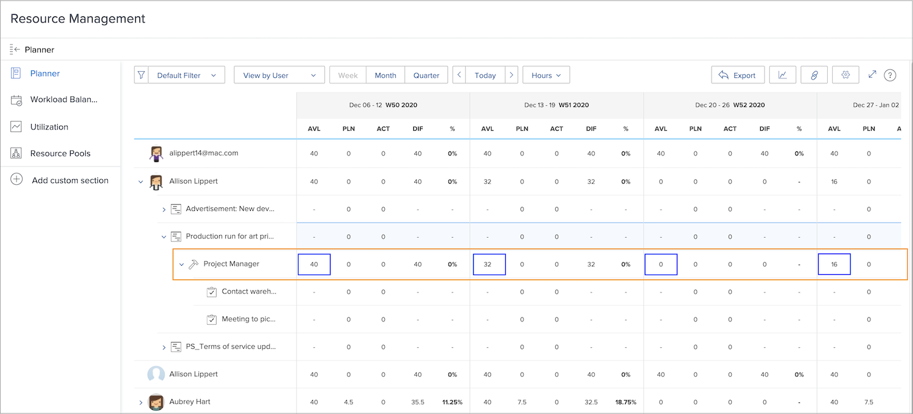

# Visibility in resource management tools

Knowing who is available and when is vital to resource planning and management. When users mark their personal time off in the calendar in Workfront, that information can also be seen in Workfront’s resource tools.

## Resource planner

A user’s time off is reflected in the Available (AVL) column in the resource planner. Workfront subtracts the time off marked on their calendar from the available time, as calculated by Workfront based on assigned schedule, job role percentage, etc.

## Workload Balancer

In the Workload Balancer, time off appears as gray bars on the calendar. This visibility helps resource managers and others make more informed decisions when assigning work.

However, the time off indicator does not prevent work from being assigned to the user through the Workload Balancer. If work is assigned, the Workload Balancer shows the person is over-allocated during the time off period.

