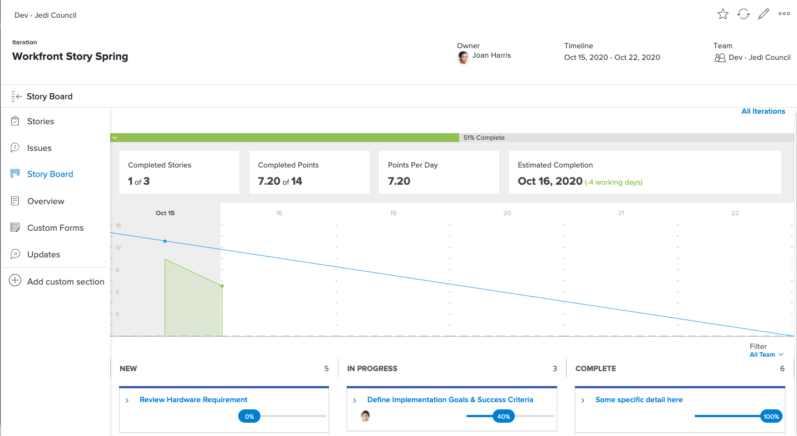
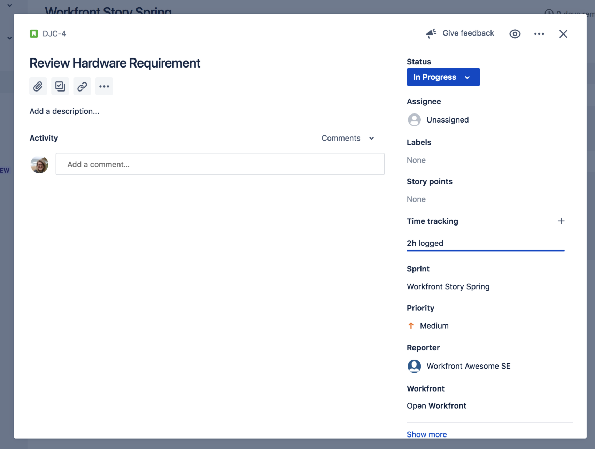
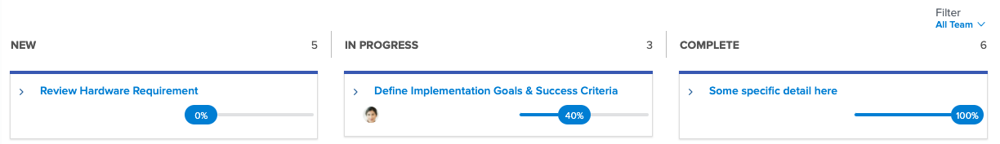

# [!DNL Jira]  integration

[!DNL Jira]  is a product used to track projects and issues for development and technical support teams. While many teams use Jira to track task level progress, they use [!DNL Workfront] to do true project management because they can get a high-level progress view. With the [!DNL Jira]  native integration, this information can automatically transfer between the two applications.

## What is [!DNL Jira] ?

[!DNL Jira]  is a product created by [!DNL Atlassian] to track projects and issues for development and technical support teams. Many teams use [!DNL Jira]  to track task-level progress, but they also use [!DNL Workfront] to manage projects. This means teams double their efforts by creating tasks both in [!DNL Workfront] and [!DNL Jira] . Yet with the [!DNL Jira]  native integration, that kind of information can automatically transfer between the two applications.

## What can a [!DNL Jira]  integration do?

Here we have a sprint in [!DNL Workfront] titled "[!DNL Workfront] Story Spring."

Joan Harris, the Dev-Jedi Council Agile team lead, uses the scrum board and burndown chart as a way to measure the progress of the overall sprint. It gives the team a nice visual representation of what’s going on. In addition, this information is feeding into an executive report that’s reviewed every quarter. However, most of the team makes their updates in [!DNL Jira] , not [!DNL Workfront].

Joan’s team has been using [!DNL Jira]  for several years and find it’s a good way for them to track individual tasks and/or bugs they’ve been assigned to work on. But Joan really needs that information to connect to [!DNL Workfront] and, ultimately, feed those executive reports.

Through the [!DNL Jira]  native integration, any updates made to tasks, stories, or bugs can automatically update the tasks, stories, and/or issues in [!DNL Workfront].

So, when the team member assigned to the Review Hardware Requirement story makes an update to the status in [!DNL Jira] , moving it from “New” to “In Progress,” that update will automatically change the status of the story in [!DNL Workfront] as well.

