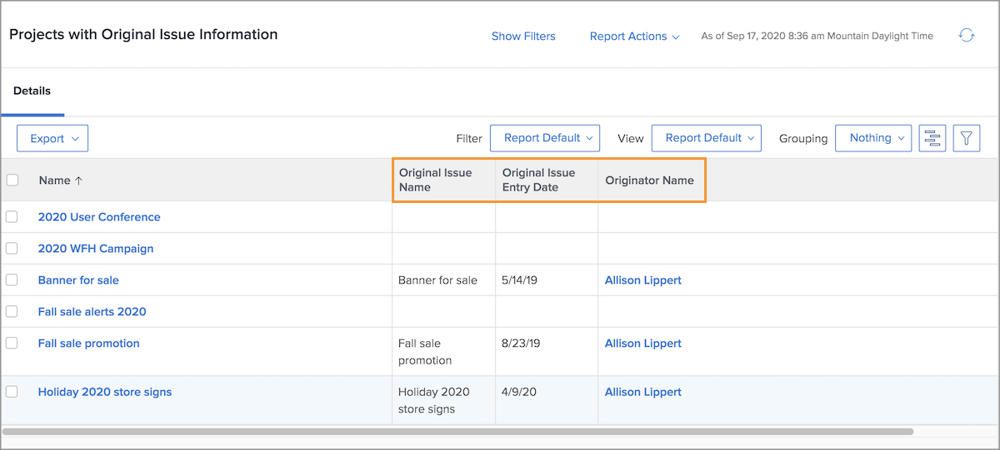

# Report on issues

## Centralize issues by creating a report

Many traffic and project managers create a [!UICONTROL Workfront] custom report to centralize all incoming issues. This makes it easy to track what’s new and needs attention.

The report can then be added to a dashboard, putting everything you need to do your work in one [!UICONTROL Workfront] window.

![An image of the [!UICONTROL Resolving Object] column of an issue report.](assets/18-resolving-object-report.png)

To display the name of the task or project the issue was converted to, include the “[!UICONTROL Resolving Object]” column in the view. A “[!UICONTROL Resolving Object]” is the task or project created when you convert an issue. If an issue has not been converted the [!UICONTROL Resolving Object] field will be blank. This report quickly lets you see which issues have already been converted, so you don’t end up with duplicates. Just click the resolving object name to open it so you can track progress on the work being done.

## Show original issue information in reports

Sometimes an issue is converted into a task or project so the work needed to resolve it can be tracked and monitored according to your organization’s workflows.

A project or task report can display useful information about the original issue. These columns can be added to a custom view with text mode reporting:

* [!UICONTROL Original Issue Entry Date]
* [!UICONTROL Original Issue Name]
* [!UICONTROL Original Issue Originator Name]

<!-- Need wf one documentation article link below

For the text mode used to create this report, see the Workfront One article titled View: Display original issue information on task and project list.

-->

<!--  Learn more graphic and documentation article links

* Create and customize views
* Overview of resolving and resolvable objects
* Understanding resolving and resolvable objects

-->
