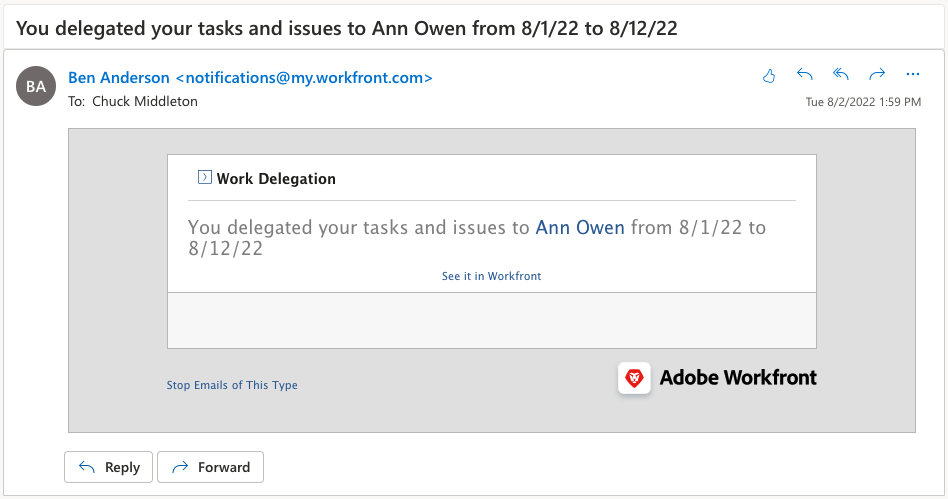

# Delegate tasks, issues, and approvals

Learn how to delegate approvals for projects, tasks, issues, and timecards to another Workfront user. Also learn how to delegate task and issue assignments.

## Delegate approvals

Learn how to delegate approvals for projects, tasks, issues, and timecards to another user.

In this video, you will learn how to:

* Assign approvals to someone else
* End the delegation period
* Find delegated approvals 

>[!VIDEO](https://video.tv.adobe.com/v/336094/?quality=12)

<!---
learn more URLS
Delegate approval request
--->

## Delegate task and issue assignments

You can delegate the tasks and issues assigned to you to other users when you plan to be out of the office. 

### How to enable task and issue assignment delegation

Before it can be used, task and issue delegation must be enabled by a group or system administrator. This is done in [!UICONTROL Setup > Project Preferences > Tasks & Issues > Delegation]. Enabling this will allow all users with a Review or higher license to delegate their assigned tasks and issues.

![Screenshot showing [!UICONTROL Setup] preferences for delegation](assets/delegation-1.png)

### How to delegate task and issue assignments

Navigate to [!UICONTROL Home] and click [!UICONTROL Delegate], then specify the user you're delegating all your assigned tasks to and the date range. You can designate any user with a Review or higher license.

![Screenshot showing the delegation tab in [!UICONTROL Home]](assets/delegation-2.png)

### How to tell if a task or issue has been delegated

You can see when tasks or issues have been delegated in [!UICONTROL Home] or in the task or issue view.

![Screenshot showing delegated task assignment in [!UICONTROL Home]](assets/delegation-4.png)

### Email notifications that apply to delegated work

Your group or system administrator can enable email notifications that will let you know when you have delegated your tasks and issues and when someone's tasks and issues have been delegated to you.

![Screenshot showing [!UICONTROL Setup] email notification options for delegation](assets/delegation-5.png)

