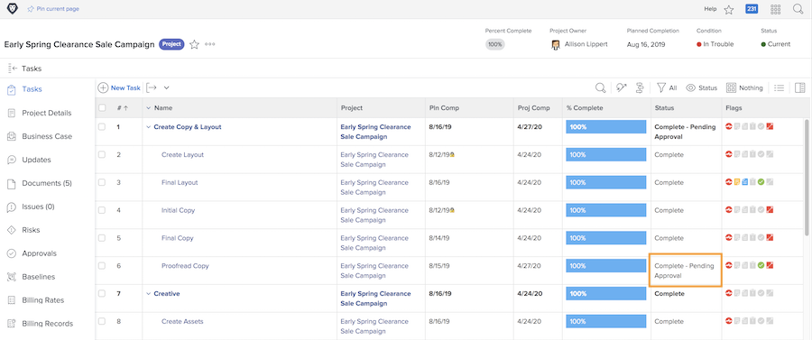

# Complete approvals

Task and issue approvals are a part of many workflows. But unresolved approvals can prevent you from setting the project status to Complete.

On the [!UICONTROL Task] section of your project, select a [!UICONTROL View] that includes the [!UICONTROL Status] column. A quick glance down that column will show if there's an incomplete approval on a task with the "[!UICONTROL -approval pending]" after the name of the status.

You have a few choices of what to do:

* **Complete the approval —** This may mean reminding others of the outstanding approval. Do this with an update through [!DNL Workfront]. Depending on your [!DNL Workfront] permissions, you may be able to complete the approval yourself.
* **Remove the approval —** If the approval isn't needed, it might be easier to just delete it. Your ability to do this depends on your [!DNL Workfront] permissions.
* **Change the status —** Select a status that doesn't have an approval attached. Just be sure the status is equal to Complete.

If your organization uses issues to track problems, change orders, or other events during projects, follow the same steps on the [!UICONTROL Issues] section of your project.
