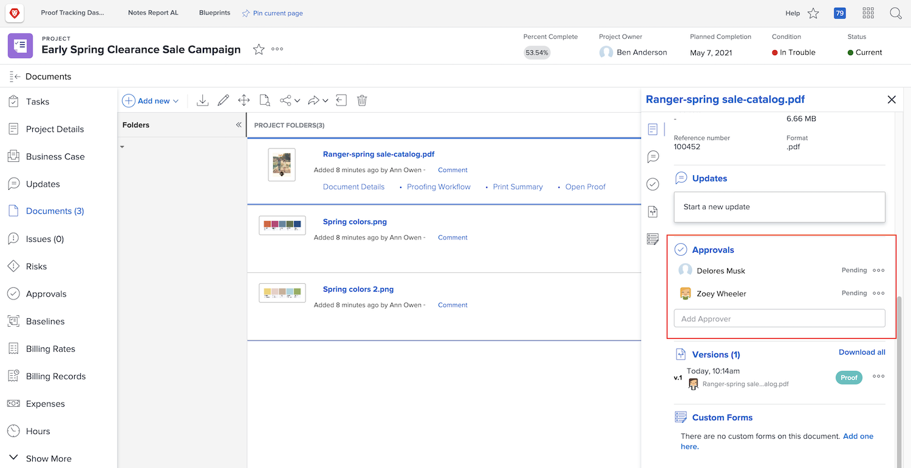

# Upload assets

Before you close out a [!DNL Workfront] project, make sure that all relevant files are attached in the [!UICONTROL Documents] section. Upload these as a document or a proof, as determined by your organization’s guidelines.

You may need to upload the document or proof as a version of an existing file.

If your organization uses proof approvals, make sure all of those are completed with a quick glance at the progress icons.

And if your organization uses document approvals, select each item in the list and check the document details to see if the approvals are complete.

<!---
learn more urls
Create proofs
Add new documents to Workfront
--->
