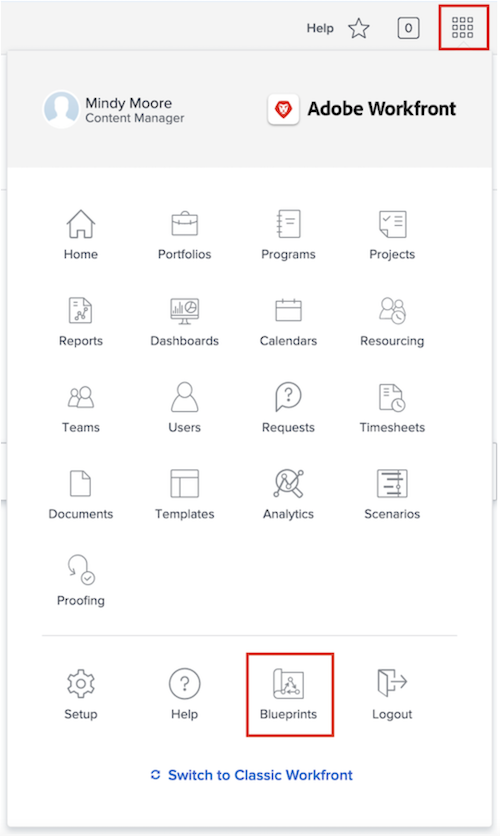

# Create a project template

In this video, you will learn how to:

* Create a template from scratch
* Create a template from an existing project
* Create a template with Blueprints

>[!VIDEO](https://video.tv.adobe.com/v/335210/?quality=12)

## Create a template with Blueprints 

  system administrators can use Blueprints to help build project templates. This feature, located in the Main Menu, allows you to access pre-built, ready-to-use templates that are targeted to a department and specific maturity level. These templates give users a head start to repeatable project creation and help maintain consistency across projects similar in scope. 

Although project templates made with blueprints can be used when creating projects, you cannot apply a blueprint directly when creating a new project (such as converting a task or request into a project). A key distinction between a blueprint and a project template is that a blueprint is used to make a template, whereas a project template is used to create a project. 

To install a blueprint to your production or sandbox environments, select Blueprints in the Main Menu. Browse through the catalog or use the Filter by type option found in the filtering menu on the right to locate and install the blueprint that fits your project needs the best. Configure details of the project template—such as mapping the blueprint’s job roles to your organization's job roles—before installing the blueprint, if needed. After installing the blueprint, you can make changes to the new template to suit your organization’s needs.
