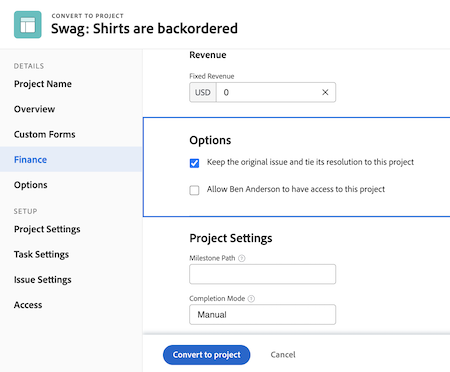
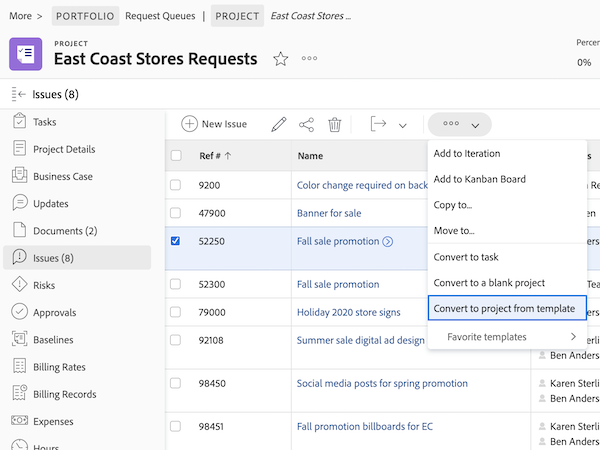

# Convert issues to other work items

## Convert an issue to a task

An issue may be significant enough that the time and effort to resolve it needs to be accounted for in the project timeline and allocate the appropriate resources. In this case, the issue can be converted into a task.

![An image of the [!UICONTROL Convert to Task] option of an issue in [!UICONTROL Workfront].](assets/15-convert-issue-to-task-menu-option.png)

1. Navigate to the [!UICONTROL Issues] section of the project or task the issue is logged on. Or find the issue in a report that you have access to.
1. Click the issue name to open it.
1. From the 3-dot menu to the right of the issue name, select **[!UICONTROL Convert to task]**.
1. Fill out the [!UICONTROL Convert to task] form. Start by giving the new task a name and description.
1. If the new task should be part of a different project, enter the project name.
1. In the [!UICONTROL Options] section, check the boxes to keep the original issue, allow access to the new task, and maintain the completion date. Follow your organization’s workflow when making these selections. Attach a custom form if you want to transfer custom form data from the issue to the task. (All fields that exist in both the issue form and the task form will transfer automatically to the task form.)
1. Fill out the custom form, if one is attached.
1. Click **[!UICONTROL Convert to task]** to finish.

![An image of the [!UICONTROL Convert to Task] form of an issue in [!UICONTROL Workfront].](assets/16-convert-to-task-options.png)

Depending on your organization’s [!DNL Workfront] system settings, you may or may not be able to change the settings in the Options section when you’re converting the task. These options affect both the original issue and the new task.

* **“Keep the original issue and tie its resolution to this task”** retains the original issue and related information (hours, documents, etc.). With this option selected, when the task is completed, the issue will be marked as resolved. If this option is not selected, the original issue will be deleted on task completion. This can affect how your organization tracks and reports on issues.
* The **“Allow (user’s name) to have access to this task”** option will allow the person who created the issue to have access to this new task.
* The **“Keep the planned completion date of the issue”** option allows you to keep the planned completion date already set on the issue. This sets the task constraint to [!UICONTROL Finish No Later Than]. If the box is unchecked, the dates of the task will be set as if a new task is created within the project.

The new task is placed at the bottom of the task list on your project. Move the task to the desired location, assign a user or team to the work, add planned hours and duration, etc.

>[!NOTE]
>
>You cannot add issues to the project timeline, since they represent "unplanned work." The project timeline is for "planned work," meaning tasks.

## Convert an issue to a project

There are times when an issue cannot be resolved by addressing the issue itself or converting it to a task because the process of resolving the issue needs to be more intricately coordinated. In this case, you can convert the issue to a project. 

1. Navigate to the Issues section of the project or task the issue is logged on. Or find the issue in a report that you have access to.
1. Click the issue name to open it.
1. Click the 3-dot menu to the right of the issue name to expose the More menu.
1. Then select if you want to create a new project that’s totally blank or use a project template, which will pre-fill task and timeline information.
1. Fill out the information in the Convert to project window, starting with the name of the project.
1. Fill out other project details as required by your team or organization.
1. In the Options section, check the boxes to keep the original issue and allow access to the new project. Follow your organization’s workflow when making these selections.
1. Fill out the custom form, if one is attached. Attach a custom form if you want to transfer custom form data from the issue to the project. (All fields that exist in both the issue form and the project form will transfer automatically to the project form.)
1. Click **Convert to project** to finish.

The project details fields that appear in the Convert to project window depend on the method you used to create the project. You will see more information in the left menu if you used the Convert to project from template option.  

>[!NOTE]
>
>Some sections, like the Options section, although visible, may be inaccessible depending on your organization’s Workfront system settings.

* Click “**Keep the original issue and tie its resolution to this project**” option. This option retains the original issue and related information (hours, documents, etc.). When the new project is completed, the issue is marked as resolved. If this option is not selected, the original issue will be deleted on project completion. This can affect how your organization tracks and reports on issues.
* The “**Allow (user’s name) to have access to this project**” option allows the person who created the issue to have access to the project being created.

## Maintain information during the conversion process

<!-- Need link to wf one doc article below 

To learn about what information transfers when you convert an issue to a task or project, we recommend you read through the conversion considerations in the Workfront One article, Convert issues. This lists what information is kept when converting issues and what isn’t. Workfront recommends you become familiar with these considerations so you don’t lose important information when converting issues to tasks or projects.

-->

Transferring the custom form data requires either:

* Multiple copies of the same custom form—one for the issue, then one for the task or project. The fields on these custom forms should be an exact match, so the information can transfer from one item to the other.

* Or a single custom form in which the issue, task, and/or project objects are selected. Using this method you only need to create and maintain your custom fields in a single custom form. This is a recent enhancement and is much easier than having multiple copies of the same form, but either method will work.

<!-- Need link to wf one doc article below

Learn more in the Workfront One article, Transfer custom form data to a larger work item.

-->

<!-- Pro tips graphic -->

If you include a custom form in a project template it will automatically be assigned when the template is selected in the conversion process.

<!-- Learn more graphic and documentation article links 

* Convert issues
* Transfer custom form data to a larger work item
* Overview of resolving and resolvable objects
* Understanding resolving and resolvable objects
* Unlink issues from their resolvable objects

-->
## Convert an issue to a task or project from any issue list

To increase the efficiency of your work and make it easier to convert issues in a fast-paced environment, you have the ability to convert an issue to a task or a project from any issue list in a project, report, or dashboard. Just select an issue and then click on the 3-dot menu that appears.

