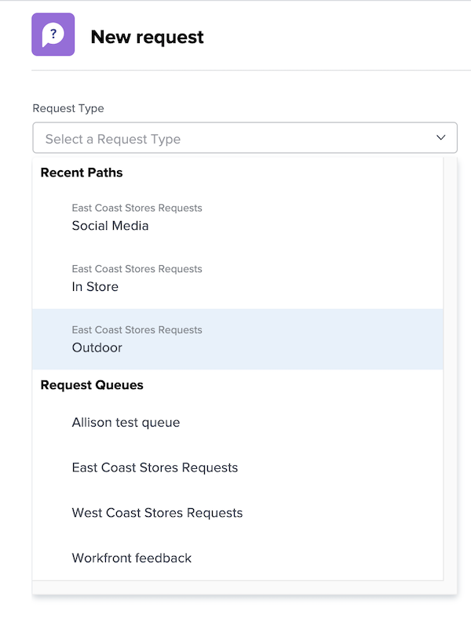
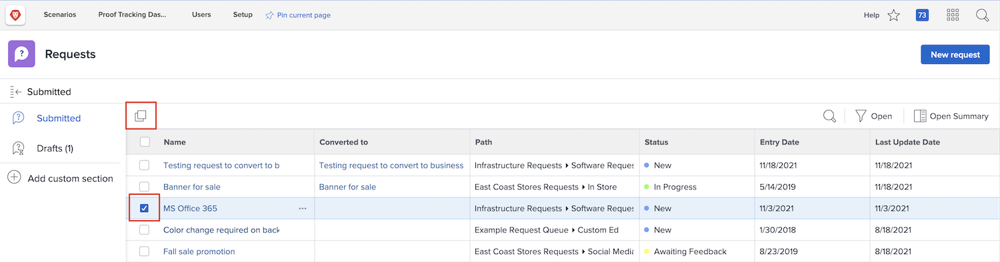
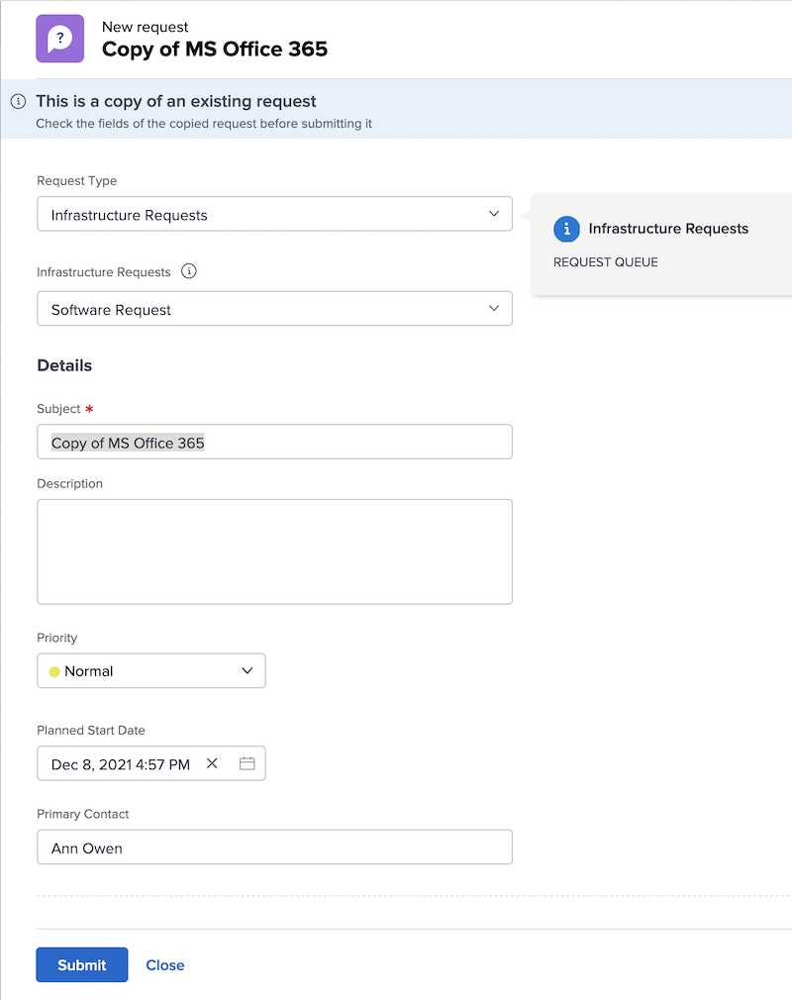

# Make a request

At many organizations, the first step in kicking off a new project, developing a new product, or creating a deliverable is making a request in [!DNL Workfront]. You can track the progress on the request and provide additional information when needed.

In this video, you will learn how to:

* Navigate to the request area
* Make a request
* View submitted requests
* Find a draft of a request

>[!VIDEO](https://video.tv.adobe.com/v/336092/?quality=12)

## Access request queue paths quickly and easily 

When you click into the [!UICONTROL Request Type] field, the last three request paths you recently submitted to automatically display at the top of the list. Select an option to file another request to that same queue.

At the bottom of the list are all the request queues you have access to. If you're not sure which queue to use for your request, use the keyword search to quickly and easily find the one you need.

As you type in keywords, [!DNL Workfront] brings up matches so you can find the request queue path that suits your needs. For example, to make a request for a social media post, start typing “social media” in the [!UICONTROL Request Type] field and the list dynamically updates to show any matches.

Select the option you want, fill out the request form, and submit the request. 

## Copy a submitted request to make a new request

When you submit the same type of request frequently, it’s time consuming to create each new request and fill out the same information again and again. Speed up the process by copying an existing request, changing just the information that needs to be updated, and submitting it as a new request. 

1. Click Requests in the Main Menu. 
1. Make sure you’re in the Submitted section by checking the left panel menu. 
1. Find and select the request you want to copy. You can copy only one request at a time. 
1. Click the Copy and submit as new icon at the top-left of the request list. 
1. The New request window opens, with the Subject field highlighted so you can name the new request. 
1. Update other information in the request, as needed. 
1. Click Submit to finish. 
1. The copied request is submitted as a new request and appears in your Submitted list. 

You can copy a request that you previously submitted, but you cannot copy a draft of a request. You can copy a request submitted by someone else as long as you have View access to the request.  

<!---
Learn more
Requests area overview
Create and submit Workfront requests
Guides
Make a work request
--->
