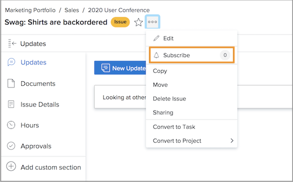
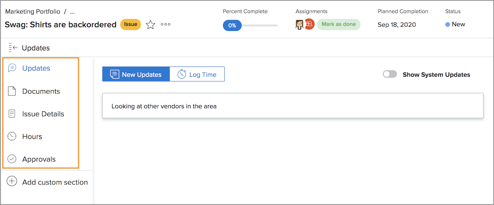

# Manage issue assignments

## Assign an issue

Logging the issue in [!DNL Workfront] is the first step to resolving problems that arise. The next step is assigning the issue to an individual user, multiple users, or a team so any associated work can be completed and the issue resolved.

Assigning an issue is just like assigning a task—fill in the [!UICONTROL Assignments] field. The issue then shows up in the assignee’s [!UICONTROL Work List] in [!DNL Workfront] [!UICONTROL Home]. If assigned to a team, it shows up in the [!UICONTROL Team Requests] section of the [!UICONTROL Team] page.

All issues logged on tasks and the project itself can be accessed from the [!UICONTROL Issues] section on the project’s page. This allows project managers, planners, and others a quick way to assign issues related to the project.

There are several ways to assign issues in [!DNL Workfront].

* Go to the [!UICONTROL Issue] section on the project or task. Click into the [!UICONTROL Assignments] field to activate the in-line editing, then enter the name of the user, users, or team who should complete the work.
You can also use the in-line editing when viewing issues on a [!DNL Workfront] report.

* Click the name of the issue, either on a report or in the **[!UICONTROL Issues]** section of the project or task. Then click into the **[!UICONTROL Assignments]** section in the header, at the top-right of the window. Don’t forget to click the **[!UICONTROL Save]** button after entering a user or team name.

![An image of the in-line editing option when clicking into the [!UICONTROL Assignments] field of an issue](assets/04-issue-assign-issue-list-assignments-field.png)

<!--
Learn more graphic and documentation article links
Assign issues
Edit user assignments for multiple issues
-->

## Receiving an issue assignment

You’ll find issues assigned to you in the [!UICONTROL Work List] in [!UICONTROL Home].

![An image of an issue assignment in the [!UICONTROL Work List] in [!UICONTROL Home]](assets/05-workfront-home-work-list.png)

Use the [!UICONTROL Filter] menu to narrow down the list so you’re viewing only issues, if desired.

![An image of the [!UICONTROL Filter] menu in the [!UICONTROL Work List] in [!UICONTROL Home]](assets/06-workfront-home-issue-filter.png)

When an issue is assigned to a team, it appears in the [!UICONTROL Team Requests] section of the [!UICONTROL Team] page. A team member can click the [!UICONTROL Work On It] button to accept the assignment or a team lead can click the [!UICONTROL Reassign] icon to give the request to a specific person.

![An image of the [!UICONTROL Team Requests] section of the [!UICONTROL Team] page](assets/07-team-page-work-on-it.png)

Issues assigned to the team also appear on the [!UICONTROL Schedule] section. This allows team leads and others to see what team members are working on before they assign the work. Drag and drop the issue bar from the [!UICONTROL Unassigned] area to a team member’s calendar to assign it.

![An image of team assignments in the [!UICONTROL Schedule] section.](assets/08-issue-assignment-team-schedule.png)

Depending on how your organization has [!DNL Workfront] set up, you may also see issues assigned to you or your team on a report that is part of a dashboard.

<!-- Learn more graphic and documentation article links

* Display items in the [!UICONTROL Work List] in the [!UICONTROL Home] area
* Manage work and team requests in the [!UICONTROL Home] area

-->

## Update progress on issues

You and your team members can post updates and log hours on issues to provide visibility into the work being done and keep everyone involved updated on the work’s progress.

Because there are multiple ways to post updates in [!DNL Workfront], follow your team’s specific directions regarding the recommended way that works with your system configurations and workflows.

Updates and hours can be posted on the issue from [!UICONTROL Home]. Click **[!UICONTROL New Updates]** to post a comment.

![An image of posting an update on an issue from [!UICONTROL Home].](assets/09-workfront-home-update.png)

When you comment on an issue, you can direct the message to other users or teams using the @name feature, much like you can on social media.

Click the **[!UICONTROL Log Time]** button to record the hours you worked on the issue.

![An image of logging hours on an issue from [!UICONTROL Home].](assets/10-workfront-home-log-hours.png)

Or you can open the issue (click the name) and record your information there.

## Subscribe to an issue

Anyone with view access to the issue is able to [!UICONTROL Subscribe] to it, which sends them a notification each time an update/comment is made on the issue. You do not get notifications when hours are logged, the status changes, or other edits are made.

Subscribing is a great way for other team members or project managers to track work they’re interested in but not assigned to or actively working on.

<!-- Learn more graphic and link to documentation article

* Update or edit a work item in the Home area

-->

## Update the issue status

In addition to posting comments or logging hours, don’t forget to change the status of the issue to indicate you’re working on it. And then change it again to indicate work is complete.

Change the status in the header from [!UICONTROL Home] or when you’ve opened the issue page.

### Unresolved issues

An issue is considered “unresolved” when the status hasn’t been updated to complete or an equivalent.

Unresolved issues prevent the task it’s associated with from being marked as done, as well as the project status from being set to complete.

<!-- Learn more graphic and documentation article link

* Mark a work item as done in the Home area

-->

## Additional features on issues

The issue page provides access to additional information and features that team members and project managers may need to properly record and manage the issue to resolution.

In addition to [!UICONTROL Updates] and [!UICONTROL Hours], other information can be accessed from the left panel menu after opening the issue.

* **[!UICONTROL Documents]**—Upload and review documents related to the issue.
* **[!UICONTROL Issue Details]**—Change issue information such as description, priority, severity, and planned completion date.
* **[!UICONTROL Approvals]**—Set up a single-use approval process for the issue or apply a global approval process. You can track the progress of the approval in this section, too.

Find the options to copy, delete, or share an issue under the 3-dot menu to the right of the issue name.

<!-- Learn more graphic and documentation article links

* Edit issues
* Copy issues
* Share an issue
* Move issues
* Grant access to an issue

-->
