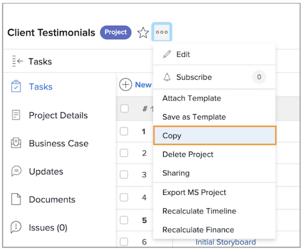
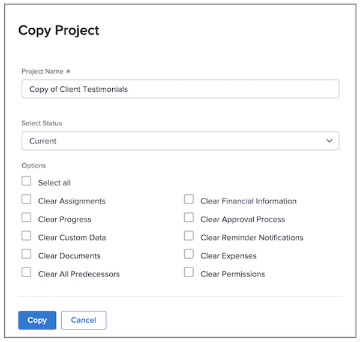

# Copy an existing project

Sometimes, instead of using a template to create a project, you just need to copy a project for another one-time use. To do this, you must have a Plan license, with Edit and Create access to projects. 

Navigate to the project you want to copy and click the 3-dot menu next to the project name. Then select Copy.

The Copy Project window lets you change the title and status, as well as clear a variety of data associated with the project—options like assignments, documents, and custom data.

Selecting Clear Assignments and/or setting the status to Planning prevents the copied project from sending out task assignment notifications right after copying.
