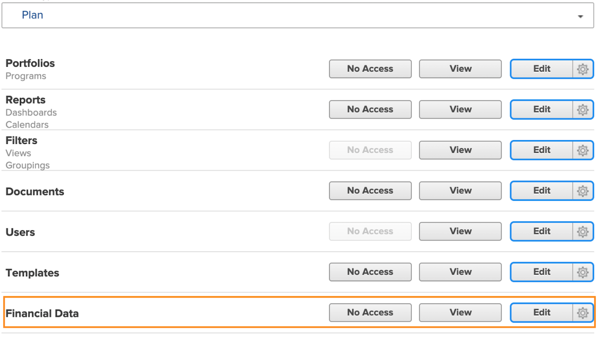
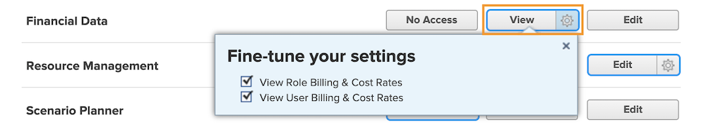
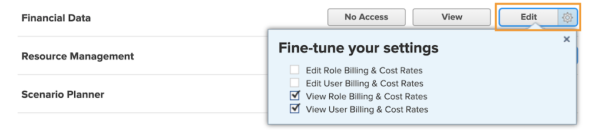

# Understand financial access

If your organization is capturing any financial data with [!DNL Workfront], as the system administrator, it is your responsibility to protect and manage who has access to view and edit that information.

Two things are necessary in order for a user to view or edit financial information:

1. Access rights must be enabled in the [!UICONTROL Access Level].
2. Permission to use those access rights must be granted on an object by object basis.

For instance, a user may be granted rights to view financial data in their access level, but they can only view financial data on a task that is both shared with them and financial viewing is enabled in the sharing of that task.

So it is possible for a user with [!UICONTROL Access Level] rights to view financials to be able to view financials on some objects and not others, depending on the individual sharing options of those objects. However no user can view financials on any object unless they have the right given to them in their [!UICONTROL Access Level].

## [!UICONTROL Access Level] settings

Overall access to financial data is granted first by [!DNL Workfront] license type.

**[!UICONTROL Plan] licenses can:**

* Manage billing records
* Manage and view role billing and cost rates
* Manage and view user billing and cost rates
* Manage expenses
* View and edit finances

**[!UICONTROL Work] licenses can:**

* Manage expenses
* View finances

**[!UICONTROL Review] licenses can:**

* View finances

**Permissions can be modified by the [!UICONTROL Access Level]. The three options for financial data access are:**

* [!UICONTROL No Access] — User will not be able to see financial information.
* [!UICONTROL View] — User can review and share the information.
* [!UICONTROL Edit] — User can create, edit, delete, and share the information. (Only available for a Plan license.)

It’s important to note that the [!UICONTROL View] and [!UICONTROL Edit] options have additional settings for a [!UICONTROL Plan] license. Click the gear on the [!UICONTROL View] button for these options:

**[!UICONTROL View]**

* View Role Billing & Cost Rates
* View User Billing & Cost Rates

**[!UICONTROL Edit]**

Those two options are available under the [!UICONTROL Edit] option, along with:

* Edit Role Billing & Cost Rates
* Edit User Billing & Cost Rates

>[!NOTE]
>
>A user with access to add expenses can also view the expenses they add, as well as expenses added by their direct reports.
