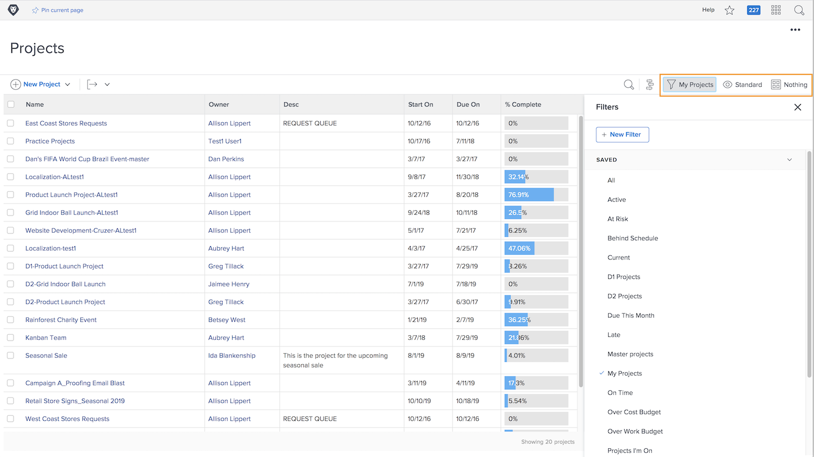

# View project information

Whether you’re looking at the main [!UICONTROL Projects] page or at an individual project, fine-tune your list to see the information you need with [!UICONTROL Filters], [!UICONTROL Views], and [!UICONTROL Groupings].

You can get a high-level look at how all of your projects are progressing on the [!UICONTROL Projects] page.

Use the [!UICONTROL Filters] to narrow down the list based on certain criteria. Then select a [!UICONTROL View] to display the columns of information that are relevant to your projects. Finally, select a [!UICONTROL Grouping] to organize the projects in a way that makes sense to you.

When you’re on the [!UICONTROL Tasks] section of a project, utilize [!UICONTROL Filters], [!UICONTROL Views], and [!UICONTROL Groupings] again to help you monitor the work being done. Because you’re looking at tasks instead of projects, you have a whole different set of choices.

Many [!DNL Workfront] customers create custom views that expose custom form information and other fields relevant to the work being done.
