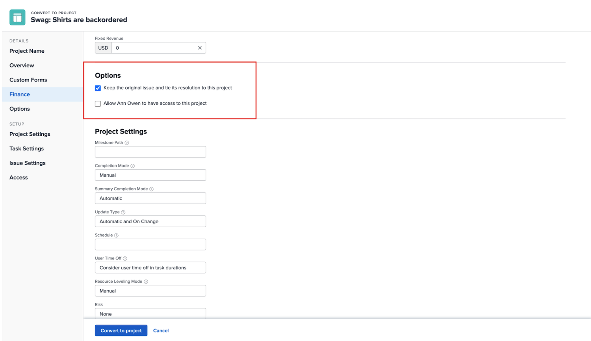

# Convert an issue to a project

There are times when an issue cannot be resolved by addressing the issue itself or converting it to a task because the process of resolving the issue needs to be more intricately coordinated. In this case, you can convert the issue to a project. 

1. Navigate to the Issues section of the project or task the issue is logged on. Or find the issue in a report that you have access to.
1. Click the issue name to open it.
1. Click the 3-dot menu to the right of the issue name to expose the More menu.
1. Then select if you want to create a new project that’s totally blank or use a project template, which will pre-fill task and timeline information.
1. Fill out the information in the Convert to Project window, starting with the name of the project.
1. Fill out other project details as required by your team or organization.
1. In the Options section, check the boxes to keep the original issue and allow access to the new task. Follow your organization’s workflow when making these selections.
1. Fill out the custom form, if one is attached. Attach a custom form if you want to transfer custom form data from the issue to the project. (All fields that exist in both the issue form and the project form will transfer automatically to the project form.)
1. Click Save Changes to finish.

The project details fields that appear in the Convert to Project window depend on the method you used to create the project. You will see more information in the left menu if you used the Convert to project from template option.  

>[!NOTE]
>
>Some sections, like the Options section, although visible, may be inaccessible depending on your organization’s Workfront system settings.

* Click “**Keep the original issue and tie its resolution to this project**” option. This option retains the original issue and related information (hours, documents, etc.). When the new project is completed, the issue is marked as resolved. If this option is not selected, the original issue will be deleted. This can affect how your organization tracks and reports on issues.
* The “**Allow (user’s name) to have access to this project**” option allows the person who created the issue to have access to the project being created.
