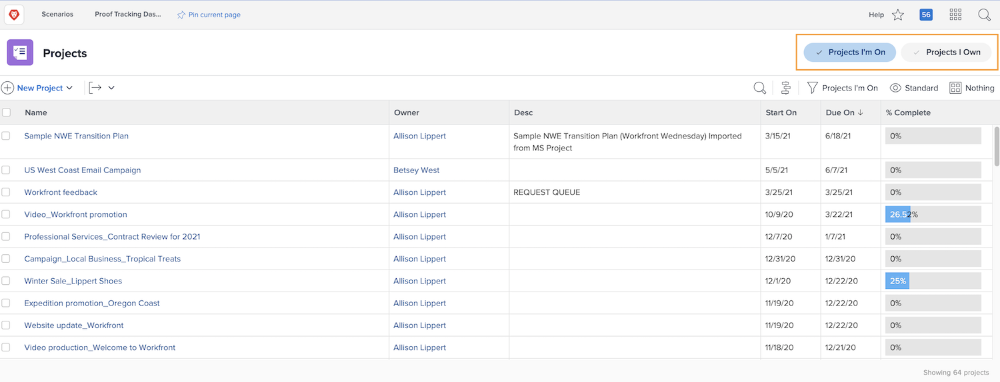
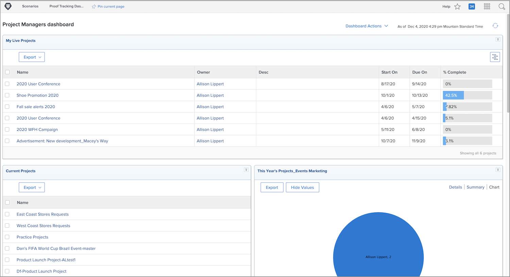

# Find projects

As someone who plans and manages projects, it’s important to easily find those projects in [!DNL Adobe Workfront] so you can keep track of how the projects are progressing.

## Projects area

Some [!DNL Workfront] managers and planners prefer to work from the [!UICONTROL Projects] area because it shows all projects you have access to without creating a separate report.

Quickly filter the list using the buttons at the top-right of the window — [!UICONTROL Projects I’m On] and [!UICONTROL Projects I Own].

* **[!UICONTROL Projects I’m On]:** Shows projects that you’re involved with in one of the following ways: you’re assigned a task in the project; you created the project; your name is in the [!UICONTROL Project Sponsor] field; or your name is in the [!UICONTROL Project Owner] field.
* **[!UICONTROL Projects I Own]:** Shows every project that has your name in the [!UICONTROL Project Owner ]field regardless of what [!UICONTROL Status] the project is in.

The selected option is highlighted in blue and [!DNL Workfront] automatically chooses that filter from the [!UICONTROL Filter] menu.

Or, you can also use the [!UICONTROL Filter] menu to modify the list of projects to find what you’re looking for. Select one of the options from the list, such as [!UICONTROL All], [!UICONTROL My Projects], or one of the filters that have been shared with you to tailor the results. 

## Dashboards

One of the most commonly used [!DNL Workfront] tools is a dashboard. Many Workfront customers create custom reports that show the projects in progress, then add these reports to dashboards they create to help people do their best work.

For example, you may have a dashboard that contains reports showing:

* Incoming work requests
* Requests that have been converted into projects
* Projects that are in the Current status
* Projects that are in the Planning status

Other options for finding projects include:

* **[!UICONTROL Favorites] list:** With the project open, add it to the list with the [!UICONTROL Favorites] icon. Then access it from the icon at the top of your [!DNL Workfront] window.
* **Pinned items in the top bar:** With the project open, click the [!UICONTROL Pin Current Page] link. The project name appears in the top bar for easy access.
* **[!UICONTROL Search]:** Click the [!UICONTROL Search] icon in the navigation bar. Narrow your search down by object type, then type in your search terms.
* **[!UICONTROL Recents] list:** [!DNL Workfront] keeps track of the most recent items you’ve had open. Access this list from the [!UICONTROL Favorites] star icon.
* **[!UICONTROL Program] and [!UICONTROL Portfolio]:** If you have access, you can go directly into a program or portfolio and click the [!UICONTROL Projects] section in the left panel.

However you find, view, and/or organize your projects, you can always click the project name to open it up and start working.

<!---
learn more:
Pin pages to customize your workspace
View and manage favorites
View recent items
Search Workfront
--->
