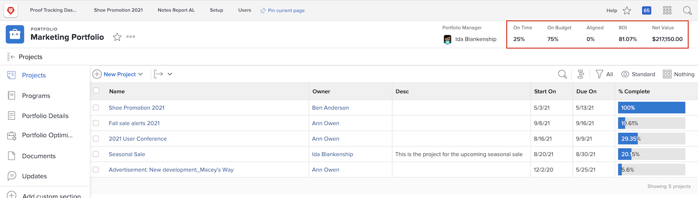

# Overview of portfolios

Managers often have the tricky job of figuring out which projects would best help their company reach its goals and objectives. That means judging a current or potential project based on criteria that is important to those objectives. This criteria can include things like the number of resources needed, how much money will the project cost vs. what it will bring in, and/or the number of risks involved. With this information, managers can decide which projects should be done first and which can be put on the back burner.  

Thinking of and planning projects isn’t an overly difficult task—it’s a process most managers are used to. The real struggle comes with comparing projects against one another. Sifting through a long and detailed list of projects is time consuming. That’s where portfolios in [!DNL  Workfront] can help.

## What is a portfolio? 

A portfolio is a collection of projects that complete for the same resources, budget, schedule, and priority. For example, a marketing agency might use a portfolio to group all the projects for a particular client. 

Navigate to the **[!UICONTROL Portfolios]** section from the [!UICONTROL Main Menu], then click a portfolio name to open it. 

You can use the **[!UICONTROL New Project]** button to easily add an existing project to the portfolio. Or you can create a new project directly in the portfolio.

![An image of the drop-down menu for the [!UICONTROL New Project] button](assets/01-portfolio-management3.png)

Once the projects are added the portfolio, you can use the summary information in the page header to get a high-level view of how the collection of projects contribute, either positively or negatively, to the overall goals. 

You also can use the portfolio optimization tool to prioritize projects that will support the overall strategic objectives. 

## Accessing portfolios

To work with portfolios, you must be assigned a Plan license in [!DNL Workfront] and have an access level assigned that gives you permissions to work with portfolios. 

When a portfolio is created, only the portfolio creator or manager has access to it. You can give access to the portfolio by sharing it. This also gives access to the programs and projects created inside the portfolio. 

Open the portfolio and click the three-dot menu, then select **[!UICONTROL Sharing]**. Add the individuals, teams, job roles, groups, or companies that should have access. Then determine what type of access each should have—manage or view.

![An image of the [!UICONTROL Sharing] option in a [!DNL Workfront] portfolio](assets/04-portfolio-management11.png)

<!--
Pro-tips graphic
If a user can’t access a specific portfolio, make sure it’s shared with them. The Workfront access level determines that a user can access portfolios in general, but sharing makes sure they can see specific portfolios. 
-->

<!--
Learn more graphic and links to documentation articles
* Portfolio overview   
* Create a portfolio 
* Create and manage portfolios 
* Navigate within a portfolio 
* Share a portfolio   
-->
