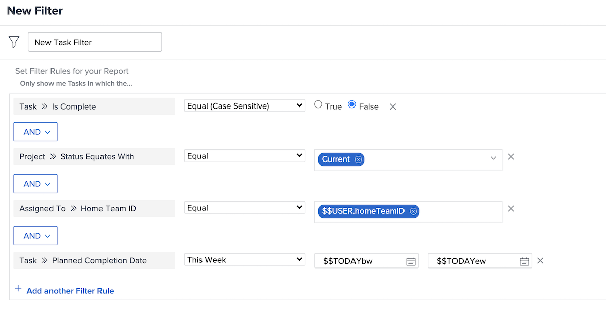

# Create filters with user-based wildcards

In this video, you will learn how to:

* Understand why to use wildcards 
* Build a filter with a user-based wildcard 

>[!VIDEO](https://video.tv.adobe.com/v/336810/?quality=12)

>[!TIP]
>
>Use the Assignment Users >> ID field source and name when building filters that look at task or issue assignment information.  This option looks at all of the Adobe Workfront users assigned to the task or issue, not just the “owner” or primary assignee. 

>[!TIP]
>
>Use the $$USER.ID (instead of your name) even when building filters for yourself. This way, if someone sees a filter you’re running and says “share that with me,” the filter is already set up so each person using it sees their own information. 

>[!TIP]
>
>You always must use the Equal filter qualifier when using user-based wildcards. 

## Activity

You have a bit of extra time this week, so you want to see if there’s anyone on your team who could use some assistance with their assignments. Create a task filter to find tasks that are due this week that haven’t been completed.  

## Answer

You’re awesome for helping out your teammates! With the filter set up like the image below, you’ll find tasks: 

* That haven’t been completed (meaning they don’t have a [!UICONTROL Complete] status or status that equates to [!UICONTROL Complete]); 
* That are in projects with a [!UICONTROL Current] status (after all, you don’t want to find tasks for projects that haven’t launched yet); 
* That are assigned to someone on your home team, as defined by Workfront team settings; 
* And that have a completion date of sometime this week (this rule used the pre-built date filter to define “this week”). 

You may need to add some additional filters if you need to limit the list a bit more. For example, you may want to add a filter rule that looks at a specific program or portfolio that your team works out of.
