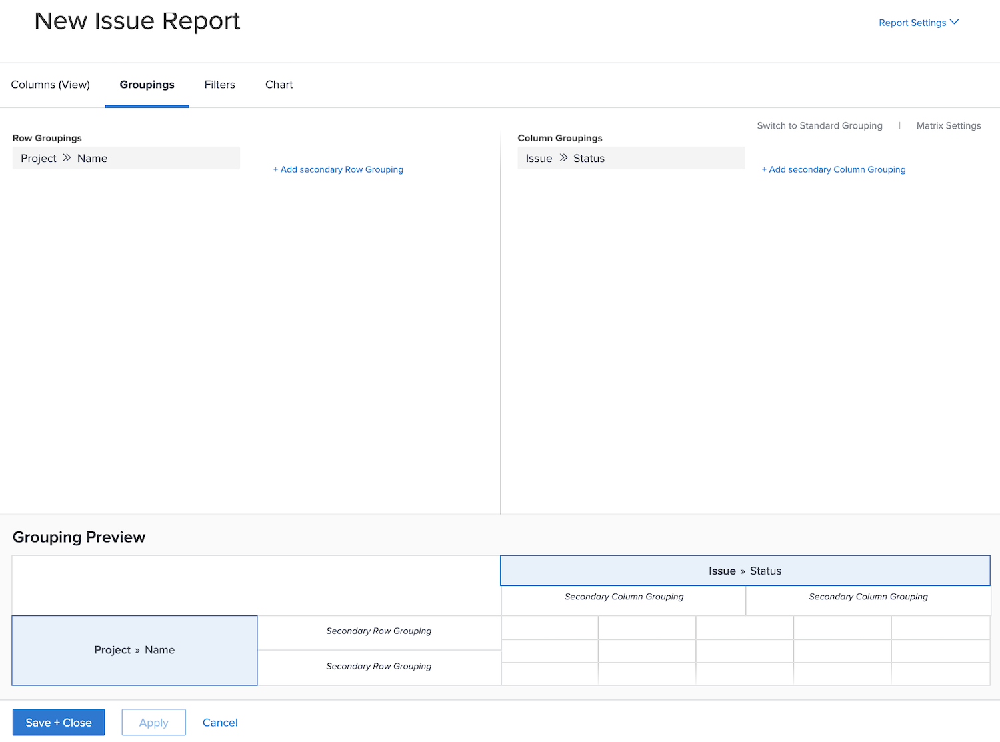

# Create a matrix report

In this video, you will learn:

* When a matrix report can be useful
* And how to create a matrix report

>[!VIDEO](https://video.tv.adobe.com/v/335156/?quality=12)

## Activity: Create a matrix report

Create a matrix report that shows how many requests there are in each status, sorted by request queue. This gives you a quick snapshot of the amount of work coming in and how well you’re keeping up with it.

You want the request queues to appear on the row groupings. Status appears as the column groupings. Name your report “Requests by Status and Request Queue.”

## Answer

1. Select **[!UICONTROL Reports]** from the **[!UICONTROL Main Menu]**.
1. Click the **[!UICONTROL New Report]** option and select **[!UICONTROL Issue]**.
1. Go to the **[!UICONTROL Groupings]** tab and click **[!UICONTROL Switch to Matrix Grouping]**.
1. For [!UICONTROL Row Groupings], select **[!UICONTROL Project]** > **[!UICONTROL Name]**.
1. For [!UICONTROL Column Grouping], select **[!UICONTROL Issue]** > **[!UICONTROL Status]**.

   

1. Go to the **[!UICONTROL Filters]** tab.
1. To make sure you see only requests in active request queues, add the following filter rules:

   * [!UICONTROL Project] > [!UICONTROL Status Equates With] > [!UICONTROL Equal] > [!UICONTROL Current]
   * [!UICONTROL Queue Definition] > [!UICONTROL Is Public] > [!UICONTROL Not Equal] > [!UICONTROL None] (this is how we know a project is actually a request queue, by the Queue Definition being assigned to one of the public options.)

1. Click on **[!UICONTROL Save + Close]**. When prompted for a report name, type in “Requests by Status and Request Queue.”

   
