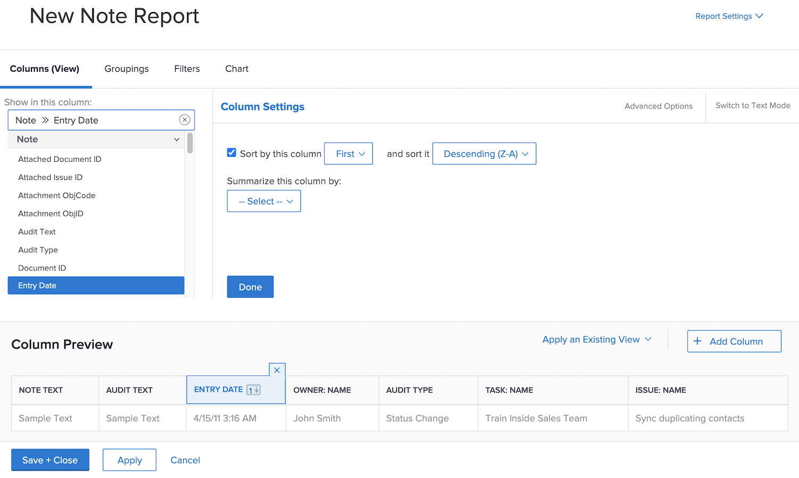
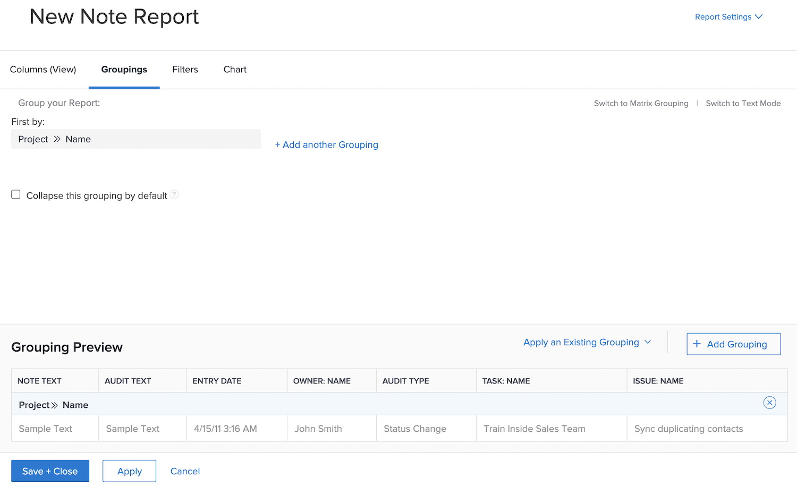

# Create a task report

In this video, you will learn:

* How to create a task report with a complex filter
* How to find the reports you create

>[!VIDEO](https://video.tv.adobe.com/v/335154/?quality=12)

## Activity: Create a note report with prompts

Create a Note report that you can use to search for user notes (i.e., comments or updates) or system notes based on the note content, the author, entry date, project name, or audit type. Name the report “Note Search.”

When using the Note Text prompt, this report will search within update threads to quickly extract any that meet the criteria specified in the prompts. When you run the report, you don’t need to fill in every prompt, just the ones you care about. The blank ones are automatically ignored.

The view should include columns for:

* Note Text
* Audit Text
* Entry Date
* Owner: Name
* Audit Type
* Task Name
* Issue Name

Leave the filter tab blank.

Group on Project Name.

Include prompts for the following:

* Audit Text
* Note Text
* Owner Name
* Entry Date
* Project Name
* Audit Type

## Answer

1. Select **[!UICONTROL Reports]** from the **[!UICONTROL Main Menu]**.
1. Click the **[!UICONTROL New Report]** menu and select **[!UICONTROL Note]**.
1. In **[!UICONTROL Columns (View)]** set up your columns to include:

   

   * [!UICONTROL Note] > [!UICONTROL Note Text]
   * [!UICONTROL Note] > [!UICONTROL Audit Text]
   * [!UICONTROL Note] > [!UICONTROL Entry Date]
   * [!UICONTROL Owner] > [!UICONTROL Name]
   * [!UICONTROL Note] > [!UICONTROL Audit Type]
   * [!UICONTROL Task] > [!UICONTROL Name]
   * [!UICONTROL Issue] > [!UICONTROL Name]

1. Select the **[!UICONTROL Entry Date]** column and change the **[!UICONTROL Sort to Descending]**.
1. In the **[!UICONTROL Groupings]** tab, set the report to group by [!UICONTROL Project] > [!UICONTROL Name].

   

1. Leave [!UICONTROL Filters] blank.
1. Open **[!UICONTROL Report Settings]** and name the report “Note Search.”
1. In the [!UICONTROL Description] field, put something like, “Search for System or User notes based on the Audit Type selected and other prompts. System notes appear in the Audit Text column and User notes appear in the Note Text column.”

   

1. Select **[!UICONTROL Details Tab]** so that it displays when the report loads.
1. Set the report to show 200 items when the report is included on a dashboard.
1. Click **[!UICONTROL Report Prompts]** and add:

   

   * [!UICONTROL Note] > [!UICONTROL Audit Text]
   * [!UICONTROL Note] > [!UICONTROL Note Text]
   * [!UICONTROL Owner] > [!UICONTROL Name]
   * [!UICONTROL Note] > [!UICONTROL Entry Date]
   * [!UICONTROL Project] > [!UICONTROL Name]
   * [!UICONTROL Note] > [!UICONTROL Audit Type]

1. Check the box for **[!UICONTROL Show Prompts in Dashboards]**.
1. Save and Close your report.
