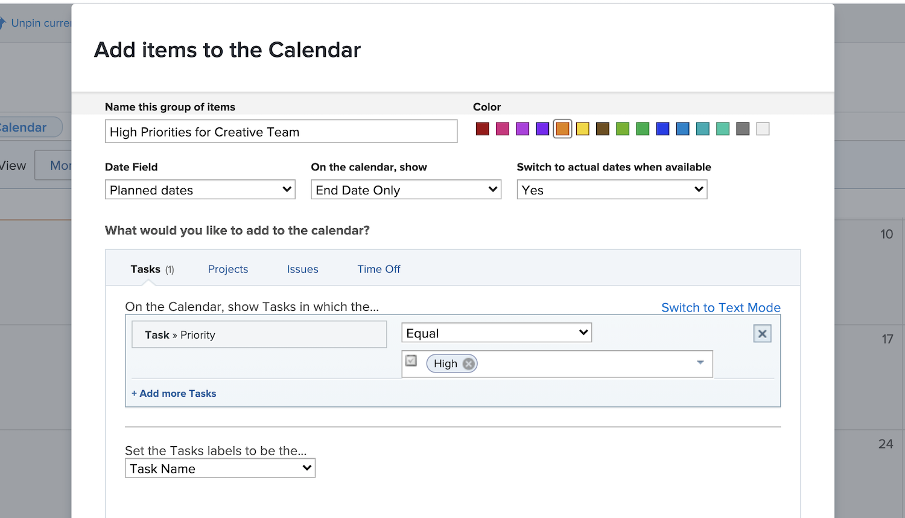

# Create a custom calendar

In this section you will learn how to:

* Create a new calendar
* Create a calendar grouping
* Add work items to the calendar grouping
* Create a time off calendar

Here's how to create your own custom calendar.

## First, add a new calendar

1. From the **[!UICONTROL Main Menu]**, select the **[!UICONTROL Calendars]** area.
1. Click the **[!UICONTROL New Calendar]** option.
1. Type in a name for the calendar and press **[!UICONTROL Return]**.

## Second, add a calendar grouping

1. To display items related to a specific project, enter the project name in the [!UICONTROL grouping] field (this displays all tasks related to that project).
1. Or click the **[!UICONTROL Add advanced items]** option to include work items from a variety of projects in the system.

## Third, add work items to the calendar grouping

1. Name the grouping to reflect what will be displayed.
1. Select a color designation for the group.
1. Select which date type to use—[!UICONTROL Projected dates], [!UICONTROL Planned dates], or [!UICONTROL Custom]. ([!UICONTROL Custom] dates are date fields included on [!UICONTROL custom forms].)
1. Select which dates to show on the calendar—[!UICONTROL End Date Only], [!UICONTROL Start Date Only], or [!UICONTROL Duration (Start to End)].
1. If you want to display [!UICONTROL Actual dates] when that information is available, select Yes from the menu. Select No if you always want the date type you selected ([!UICONTROL Projected], [!UICONTROL Planned], or [!UICONTROL Custom]) to display.
1. Select the type of item information you want to see on the calendar—[!UICONTROL Tasks], [!UICONTROL Projects], [!UICONTROL Issues], or [!UICONTROL Time Off].
1. Set up the filters to show the desired information.
1. Click **[!UICONTROL Save]**.

>[!NOTE]
>
>Additional groupings can be added to an existing calendar by using the Add to Calendar option.

## Create a calendar showing personal time off

[!DNL Workfront] provides a way for you to specify your time off with the personal time off feature in your user profile. This alerts project managers that you’re not available and allows planned completion dates to automatically or manually adjust, as needed. 

In the Calendar area, you can create a calendar view showing these time off entries. 

To create a calendar for a particular person:

1. Click **[!UICONTROL Add to Calendar]** in the left panel.
1. Click **[!UICONTROL Add advanced items]**.
1. Name the grouping to reflect what will be displayed.
1. Select a color designation for the grouping.
1. Set the [!UICONTROL Date Field] to [!UICONTROL Planned dates].
1. Select which dates to show on the calendar—[!UICONTROL Duration].
1. Ignore how the information will be displayed if Actual dates aren’t available. This doesn’t apply.
1. Select [!UICONTROL Time Off] for the type of information you want to see.
1. For the filter, set the User ID to the team member’s name.
1. Click **[!UICONTROL Save]**.

