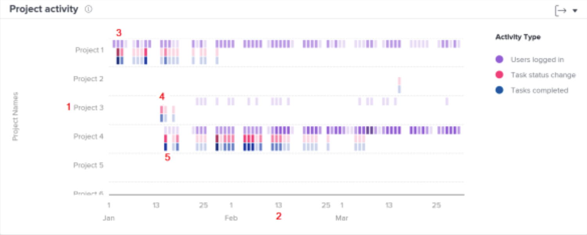

# Understand navigating and reviewing project activity

In this video, you will learn:

* How to compare projects based on users logged in, task status changes, and tasks completed

>[!VIDEO](https://video.tv.adobe.com/v/335049/?quality=12)

## Compare project work

The Project activity chart allows you to understand and compare project activities—users logged in, task status changes, and tasks completed—against other projects in Workfront. Project activities display in different colors to summarize the activities over a period of time.

Seeing this information helps you determine:

* The activity on a specific project.
* The activity of one project compared to other projects.
* Which users are working on a project and at what frequency.

On the chart, you can see:

1. Projects names on the left.
1. Dates are shown across the bottom.
1. Purple boxes show that users assigned to the project logged in on that day, with a darker shade indicating a higher number of users logging in.
1. Pink boxes show that users changed the status of a task for the project on that day, with a darker shade indicating a higher number of task statuses changing.
1. Blue boxes show that users completed a task for the project, with a darker shade indicating a higher number of tasks being completed.
