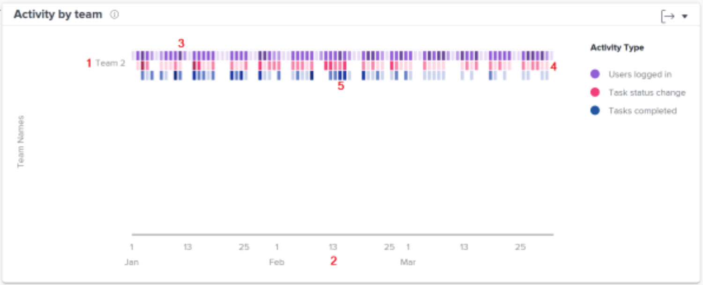

# Understand the activity by team chart

The Activity by team chart allows you to understand how your organization’s home teams spend their time in Workfront. Workfront users can be on multiple teams, but they can only be on one home team. The teams used in the People charts are made up of only those users who have that team designated as their home team. 

Activities—users logged in, task status changes, and task completed—display in different colors to summarize these events over the filtered time period.

Seeing this information helps you determine:

* Which activities are occurring within a home team and at what rate.
* Which home teams are being overworked or are using the system more.
* If the distribution of work is appropriate for the home team.

On the chart, you can see:

1. Home team names on the left.
1. Dates across the bottom come from the selected date range.
1. Purple boxes show that users assigned to the project logged in on that day, with a darker shade indicating a higher number of users logging in.
1. Pink boxes show that users changed the status of a task for the project on that day, with a darker shade indicating a higher number of task statuses changing.
1. Blue boxes show that users completed a task for the project, with a darker shade indicating a higher number of tasks being completed.
