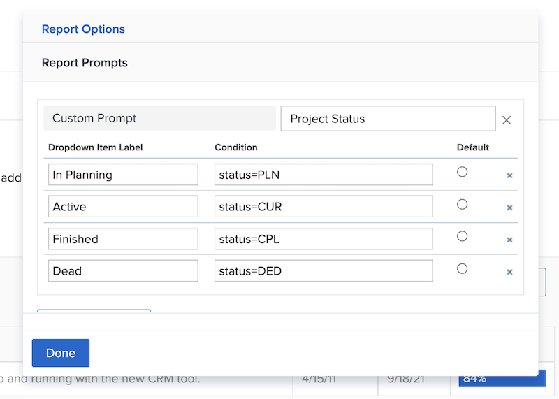

# Create custom prompts

In this video, you will learn:

* What a custom prompt is  
* How to create a custom prompt using text mode  
* Some examples that you can use in your reporting 

>[!VIDEO](https://video.tv.adobe.com/v/336822/?quality=12)

## Activity: Create custom prompts

1. Create a custom prompt that shows the following project statuses in the prompt drop-down menu:
   * Planning 
   * Current 
   * Completed 
   * Dead 
1. Modify the prompt to show current projects that are due this month. 
 
## Answers 

1. Your custom prompts should look similar to this and have the following text mode: 

   

   Once you save the custom prompt, the prompt drop-down menu should look like this: 

1.  The text mode in your custom prompt should look like this: 

   

```
   status=CUR&plannedCompletionDate=$$TODAYbm&plannedCompletionDate_Mod=between&plannedCompletionDate_Range=$$TODAYem 
```

   And the drop-down label for active prompts should be updated to reflect the change in the code like this: 

   
