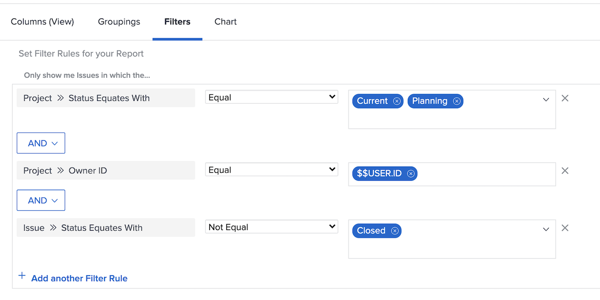

# Understand built-in issue filters

In this video, you will:

* Review built-in issue filters to see how they’re built 
* Learn about some useful issue reporting elements 
* Learn how to create your own issue filter 

>[!VIDEO](https://video.tv.adobe.com/v/336819/?quality=12)

## Activity: Create an issue report

You want to see all the issues that still need to be resolved on all the active projects you own, including issues with a resolving object. Create an issue report and name it “Unresolved issues on projects I own.”  

## Answer

Here is what the filter should look like: 

In the “My Open Issues” built-in filter, one of the filter rules excluded any issues where there was a resolving object. The reasoning behind this is that you don’t have to worry about those issues. Somebody already created a project, task, or issue that will resolve them, so what’s to worry? But they aren’t resolved yet, and in our example we’re including them to make them easy to identify and check how they’re doing. 

To do this, you need to add a column in the view tab for “Issue >> Resolving Object.” This shows the name of the resolving object, if there is one, whether it is a project, task, or issue. Clicking the name takes you to the resolving object. 

You might want to group the list based on the name of the project. 

Here is what the report should look like: 

