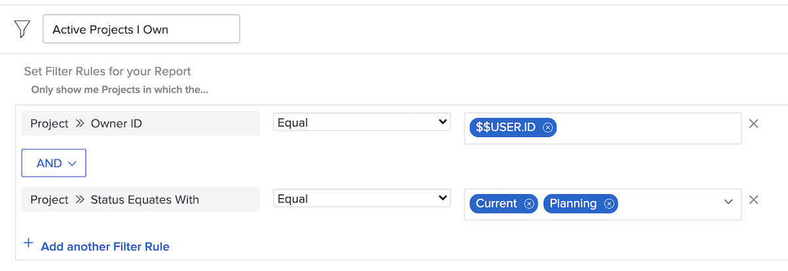

# Understand built-in project filters

In this video, you will learn how to:

* Review built-in project filters to see how they’re built 
* Create your own project filter using what you have learned 

>[!VIDEO](https://video.tv.adobe.com/v/336817/?quality=12)

## Activity: Create a project filer

You want to see all the active projects you own, where “active” means the project status equates with Planning or Current. In the Projects area, create a project filter named “Active Projects I Own.” 

## Answer

Your filter should look like this:

You can include additional filter rules, such as looking for looking for projects in a certain program or portfolio. When you do that, Workfront recommends you rename the filter to something appropriately descriptive, like “Active Projects I Own in the Marketing Portfolio.”
