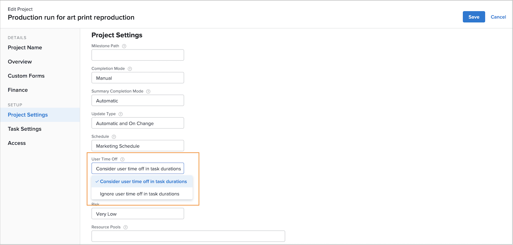
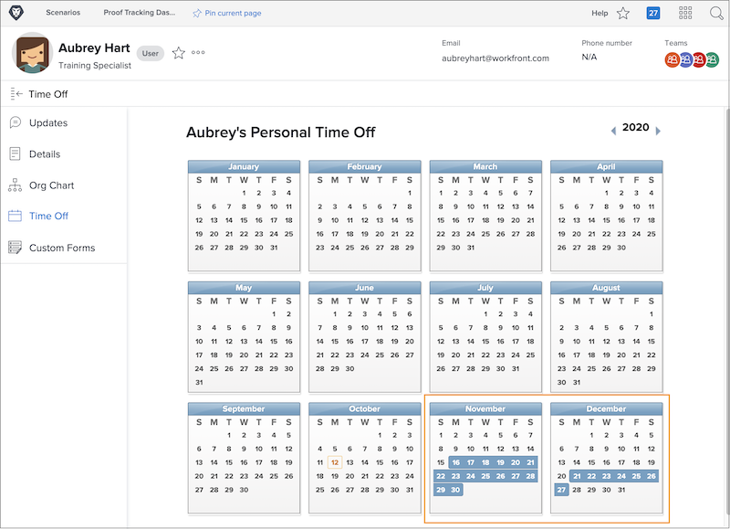
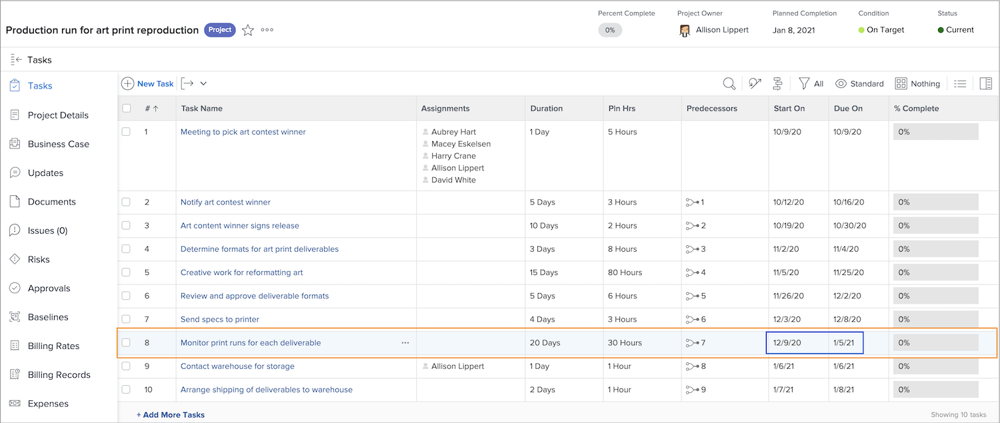

# How time off affects project timelines

Whether an assigned user’s time off factors into the project timeline depends on a project setting called [!UICONTROL User Time Off]. This setting determines if the time off for the primary assignee of the task adjusts the planned dates for that task on the project.

Let’s look at what happens with a project timeline when each of the settings is selected—C[!UICONTROL onsider user time off in task durations] or [!UICONTROL Ignore user time off in task durations].

## Consider user time off in task durations

This option is Workfront’s default setting.

In this example, the primary assignee for the task has days off marked on their personal calendar.

The project manager wants to assign this person to a task that has planned dates that overlap the user’s time off.

When this user is assigned to the task, the planned dates adjust automatically. Now the task’s planned completion date has extended by several days to accommodate the user’s time off. It’s important to note this change can affect the planned dates of other tasks in the project and, potentially, the project’s planned completion date.

## [!UICONTROL Ignore user time off in task durations]

With this option, the planned dates of the task remain as originally planned, even if the primary assignee has time off during the duration of that task.

The team member has days off marked on their calendar.

The project manager assigns them a task that overlaps the time off. Once the user is assigned, the task planned dates remain as originally planned.

To ensure the work gets done on time, it might be helpful to assign another person who can work on the task while the original assignee is out of the office.

## Adjust the setting at the project level

To change the User Time Off setting on a project:

* Open the project by clicking its name in Workfront.

* Select [!UICONTROL Edit] from the 3-dot menu in the page header, to the right of the project name.

* Scroll to the [!UICONTROL Project Settings] section and find the [!UICONTROL User Time Off] field.

* Select the option you want to apply to this project — [!UICONTROL Consider user time off in task durations] or I[!UICONTROL gnore user time off in task durations].

* Click the [!UICONTROL Save] button in the upper-right corner of the window.

**Note**: This setting is not available when you select [!UICONTROL Project Details] from the left panel menu of the project page.

A global setting for this exists in the project preferences in the [!UICONTROL Setup] menu. This setting is managed by your system administrator. Group administrators may be able to adjust this setting for the groups they manage.

Workfront recommends the setting be set the way you want the majority of your projects to handle time off at your organization.

The setting also can be built into project templates, through the template details.
