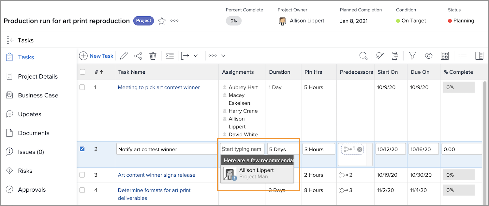
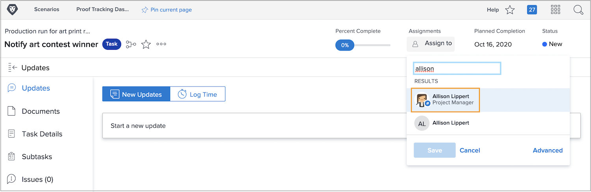

# See time off when assigning tasks

A small icon indicates a user has time off marked on their personal calendar during the duration of the task when you’re assigning users.

When assigning from the project plan by typing in a user’s name, you see their name grayed out and a small blue warning icon next to their avatar picture.

If you’re assigning from the task page header, you see a small blue airplane icon next to the person’s avatar to alert you they have time off during the duration of this task.

