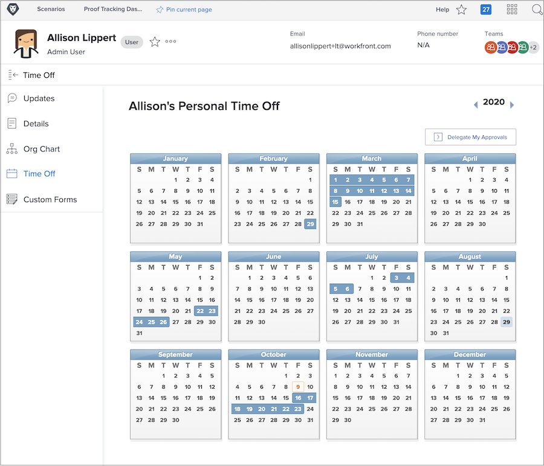
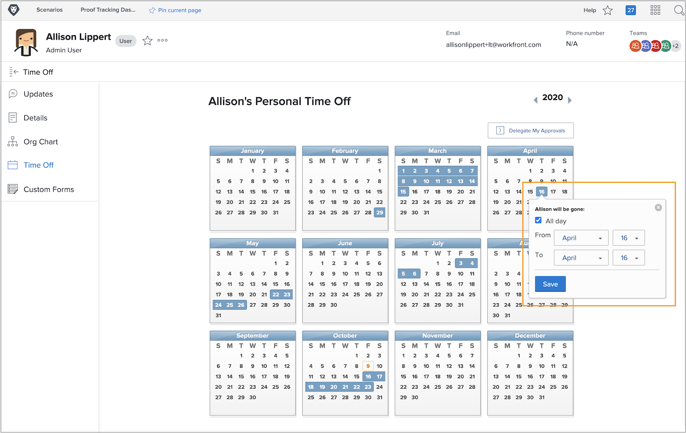

# Why use the time off calendar?

When planners and project managers assign tasks in Workfront, knowing which team members are available to complete assigned work contributes to on-time project completion.

Accurate availability data also plays into current and future work planning as resource managers review allocation in Workfront’s resource planning and management tools.

Workfront Work and Plan license users can use the personal time off calendar to indicate when they’ll be unavailable during typical working hours. Even a half-day off could affect the completion of tasks assigned to them.

**Note**: Workfront is not designed to replicate or replace your organization’s existing systems for managing, accruing, or tracking personal time off. Follow your organization’s guidelines for requesting and managing time off.

## Mark your time off

Your personal time off calendar is on your user page in Workfront, which is accessed from the Main Menu. Click your name in the left corner.

* Click Time Off in the left panel menu on your user page in Workfront.

* By default, the current year displays. If needed, use the arrows to select a different year (at the top-right of the calendar window).

* Click a date on the calendar.

* Workfront assumes you’re taking the whole day off. If that’s the case, go ahead and click the Save button.

* If you’re taking off consecutive full days, change the To date to your last day out of the office. Click the Save button.

* If you’re not taking the whole day off, uncheck the All Day box. Then indicate the hours you’ll be working that day (the hours you’re available). Click the Save button.

Your time off is indicated by blue boxes on the calendar. This time off also shows up in other places in Workfront to assist with project and resource planning.

**Pro-tip**: If a task is already assigned to you, then you mark time off on the calendar, there is no notification sent to the project manager to let them know you won’t be available. Be sure to update the project manager with any new time off that may affect current projects or the work you’ve been assigned.
