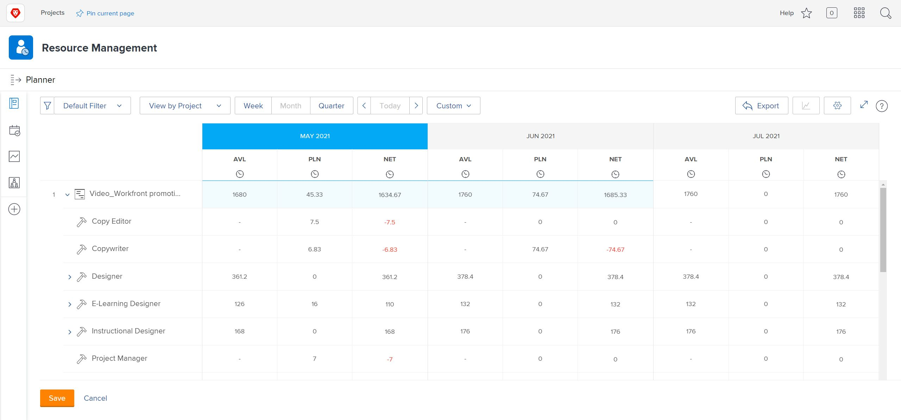

# View by project in the [!DNL Resource Planner]

In this video, you will:

* See [!UICONTROL View by Project ]view
* Learn how resource information is displayed in this view

>[!VIDEO](https://video.tv.adobe.com/v/335170/?quality=12)

For the View by Project option, the default is to show the Budgeted column, which pulls in the estimated number of resources needed for a project from a business case, if it has been filled in. This also means the Net column is, by default, using the numbers from the Budgeted column to tell you how many resources are left.

However, your organization may not be using, or be ready to use, business cases to estimate those amounts. Instead, you use the planned hours already entered on a project. Through the Customize option, you can choose which columns appear in your chosen view and how you would like the Net column to be calculated.

To change the columns that appear and the Net column calculation so it’s based on planned hours:

* Click the Hours drop-down menu and select Customize.

* In the Customize displayed metrics box, determine what columns appear and check the box next to Use Planned (PLN) values in NET calculations. 

**Note**: You can edit the columns and calculations for the different view types in the Resource Planner by selecting an option on the left side of the box.

* Once you click Save, the box closes and the screen refreshes.

The Resource Planner shows what you need to know about your supply and demand without complex spreadsheets and round-robin communication.

With the information on hand and the tools at your command, you can fine-tune your team’s capacity to execute the work that’s important to you.
