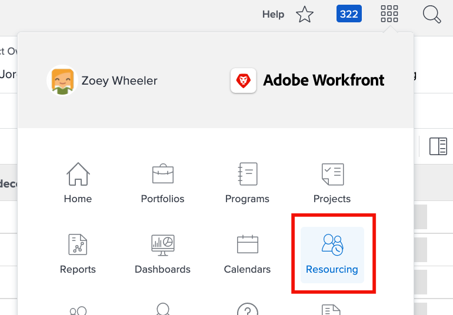
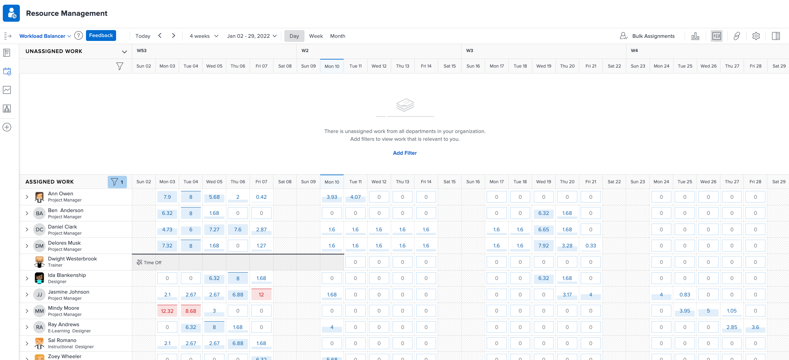
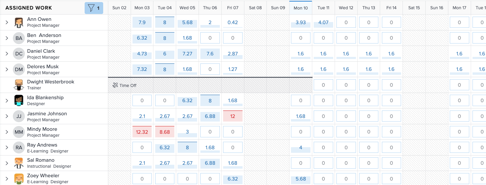
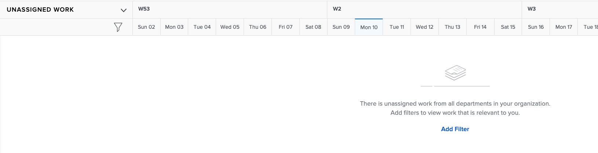

# Find the [!DNL Workload Balancer]

Knowing what resources are available and how to distribute them can be a challenging task for anyone. That’s why Workfront created the [!DNL Workload Balancer].

Its purpose is to give you greater insight into and management of the daily and weekly workloads of the people you manage. This helps you make better assignments, based on role and availability, across multiple projects.

* Click [!UICONTROL Resourcing] in the [!UICONTROL Main Menu].
* Go to the [!UICONTROL Scheduling] section in the Resource Management area.
* Click the [!UICONTROL “Switch to Workload Balancer”] link.

The [!DNL Workload Balancer] is the default option when going to the Resource Management area of the Workfront tool.

## Areas within the Workload Balancer

Two sections appear in the [!DNL Workload Balancer]: Assigned Work and Unassigned Work.

The Assigned Work area shows a list of users and the work they’ve already been assigned to within Workfront. By default, this area is filtered to users who are part of the Workfront teams you belong to. This way you can see what team members have been assigned to work on.

The Unassigned Work area shows work that still needs to be assigned, whether to a person, job role, or team. However, initially, this area won’t show anything. 

By starting with the Unassigned Work area blank, you have the opportunity to first focus on the current workloads of your users, in the Assigned Work area, before making assignments.
