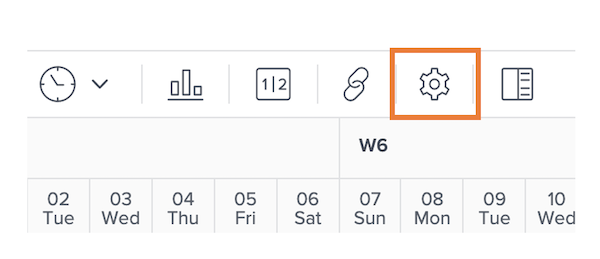
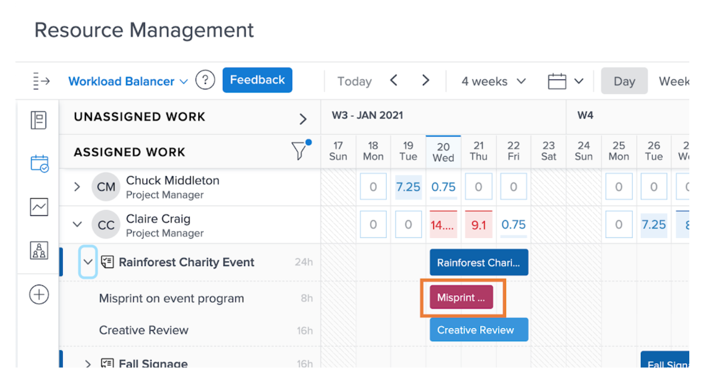
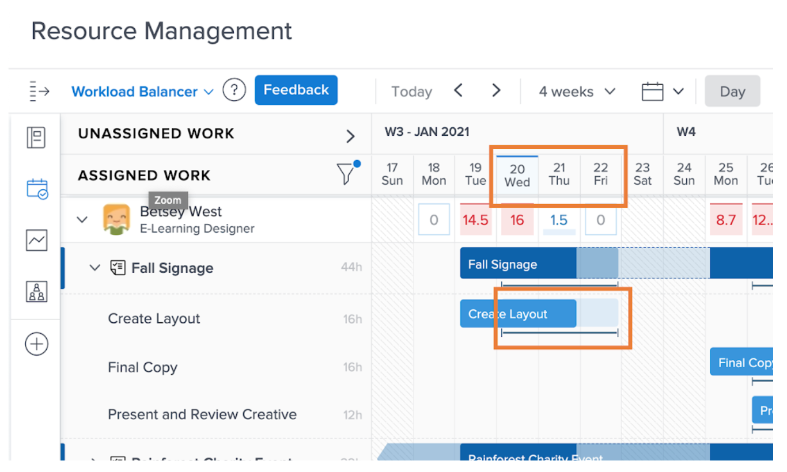
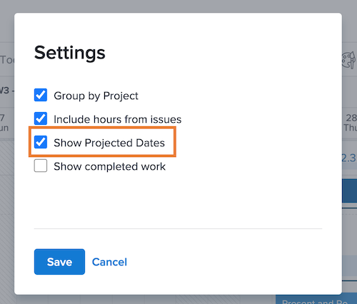

# Settings to consider for the Workload Balancer

There are a couple of Workload Balancer settings to consider as you dive into the individual workloads of your users:

* Issues assignments
* Projected Dates
* Completed work

These can be turned on or off through the Workload Balancer Settings icon.

## Include hours from issues

By default, the Workload Balancer shows tasks only. However, users may be assigned to requests and issues that need to be fulfilled or resolved, and that eat into time they can spend on project work.

To get a better understanding of the full workload a user has, Workfront recommends issues be included in the list of assigned user work.

Just check the Include hours from issues option in the Workload Balancer Settings area.

In the Assigned Work area, issues appear as light maroon bars.

### Project dates

Another option available through the Workload Balancer settings is to show workloads based on projected dates.

The default setting shows assigned work based on the planned dates entered in the project.

Because projected dates are based on the progress and completion of prior tasks in the project, you’re able to get a “real time” view of when a task will start or finish, which is especially useful when looking at workloads.

You can switch between viewing planned and projected dates with the Show Projected Dates option in the Workload Balancer settings.

### Completed tasks

Completed tasks are shown in the Workload Balancer along with those currently in progress or about to begin. To get a better understanding of what additional work users can take on, you may want to exclude completed work.

Uncheck the Show completed work option in the Workload Balancer settings.

