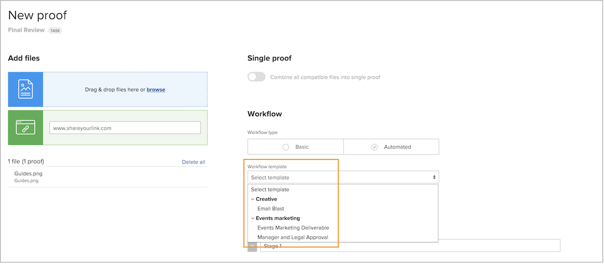

# Create template groups to organize automated workflow templates

Before you start making automated workflow templates, [!DNL Workfront] recommends that you make template groups to help organize the templates. Groups — think of them as a bucket for holding the various templates — are helpful when you have multiple teams or departments using proofing, as they help keep templates organized so people assigning review and approval processes know which templates to use.

If you’re not sure yet how you want to organize templates into groups, you can add the group information later. However, it’s easiest to assign a template group as you’re creating a template. 

You’ll see these groups not only in the proof setups but when selecting a template while applying a proof workflow. The bold terms in the template list are the groups.

Template groups are optional. If your organization has just a few templates, you might not need to organize them in groups.

**To create a template group**

1. Select **[!UICONTROL Proofing]** from the **[!UICONTROL Main Menu]** in [!DNL Workfront].
1. Select **[!UICONTROL Account Settings]** once the proofing setups area opens.
1. Go to **[!UICONTROL Workflows]** in the left panel menu.
1. Select **[!UICONTROL New template group]** from the **[!UICONTROL New]** button.
1. Name the group.
1. Click outside the field to save.

The new group now shows up in the list.

## Delete a group

If you delete a group that contains templates, those templates are preserved and moved to a generic “[!UICONTROL Workflow templates]” group. You can move the templates into other groups, if needed.

<!--
Learn More Icon
Create and manage Automated Workflow templates
-->
