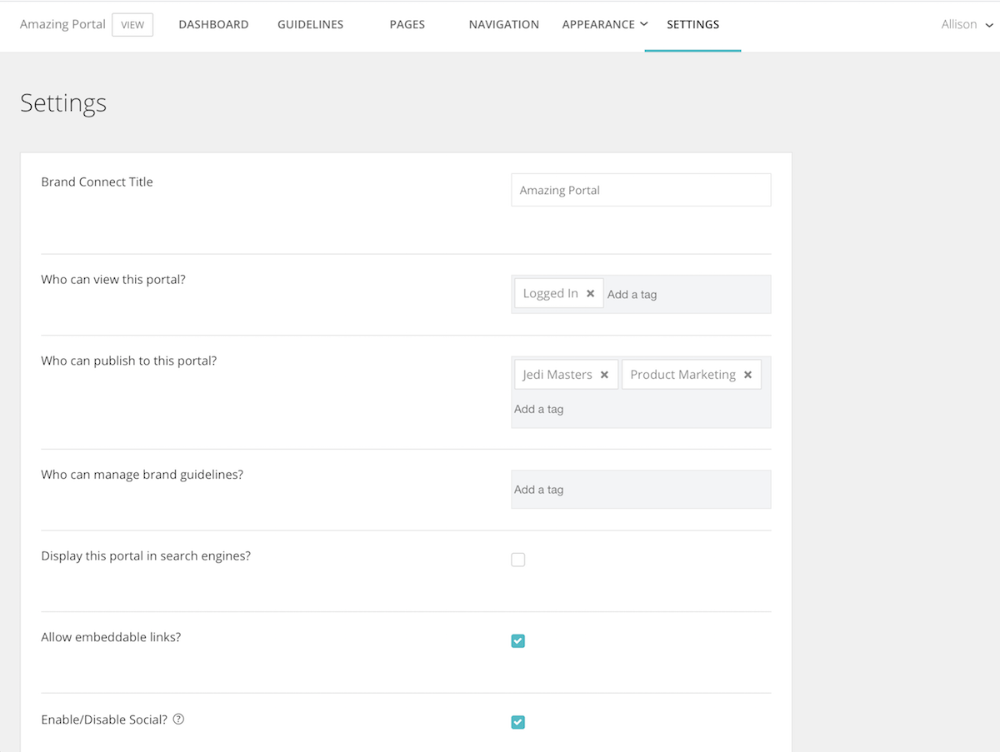

# [!UICONTROL Brand Connect]: establish [!UICONTROL Brand Connect]

The [!UICONTROL Brand Connect] settings control who can see the portal, who can publish content to the portal, and who can manage the brand guidelines. 

To access the settings, log into [!UICONTROL Workfront DAM].

1. Click the **settings icon** in the navigation bar and select **[!UICONTROL Brand Connect]**. Or click **[!UICONTROL Brands]** in the navigation bar.
1. Then click the **[!UICONTROL Edit]** option at the top-right corner of the [!UICONTROL Brand Connect] panel. If your organization has multiple [!UICONTROL Brand Connects], make sure you’re editing the right one.

Talk to your [!UICONTROL Workfront] consultant if you have questions about any of these settings.

* **[!UICONTROL Brand Connect] Title**—Name the [!UICONTROL Brand Connect] (or change the name).
* **Who can view this portal?**—Set the groups that can view the [!UICONTROL Brand Connect]. For example, if you add the [!UICONTROL Logged In] group, then all logged in users can see the portal. However, the folder permissions still apply, so even though a user can see the portal, they won’t be able to access assets unless the [!UICONTROL Logged In] group was given permissions to the folder.
* **Who can publish to this portal?**—Set the groups that can publish assets to the [!UICONTROL Brand Connect]. These will be contributor groups. They can only publish items that they have access to.
* **Who can manage brand guidelines?**—Set the groups that can manage the Brand Guidelines. Managing the guidelines are not limited to admin users. You can set a contributor group to edit the guidelines.
* **Display this portal in search engines?**—Do you want the [!UICONTROL Brand Connect] URL to show up when people run searches on the internet?
* **Allow embeddable links?**—Can embeddable links come from the [!UICONTROL Brand Connect]? This adds a [!UICONTROL Get Links] panel to the [!UICONTROL Share] menu that provides embeddable links for the asset.
* **Enable/Disable social?**—If social is enabled (check the box), users can like and comment on assets.
* **Enable/Disable download and view count?**—When enabled, users can see how many times an asset has been downloaded and how many comments it has.
* **Hide facets initially**—Hide the metadata search filters that appear in the left panel on the [!UICONTROL Assets] page.
* **Lightbox label**—Select a label for [!UICONTROL Lightboxes] — [!UICONTROL Lightbox], [!UICONTROL Collection], [!UICONTROL Favorites], or [!UICONTROL Favourites].
