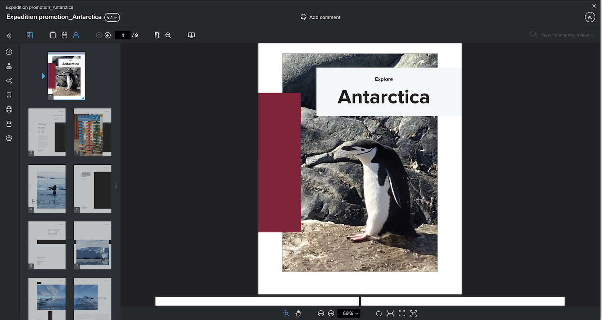

# Combine multiple files into a single proof

Combining multiple files into a single proof can oftentimes make the proofing process more streamlined.

The “combine” option is helpful when individual files are related or part of a whole deliverable and all the files need to be reviewed by the same people by the same deadline.

For example, the creative team designed a booklet. Four designers produced the pages and saved them as individual PDFs. If each designer uploaded these as individual proofs, reviewers would have four separate proofs to review. In addition, it would be harder to make sure the pieces of the booklet fit together.

Solution—have one person upload all the PDFs and combine them into a single proof on upload. This allows reviewers to see the booklet as a whole, instead of disconnected parts.

To combine proofs:

1. Open the [!UICONTROL Documents] section of the project, task, or issue the proof should be attached to.
2. Drag and drop the files into the upload area or browse to them. [!DNL Workfront] supports combining up to 50 files.
3. Toggle on the option for [!UICONTROL Combine all compatible files into a single proof].
4. Enter a name for the combined proof. This is required.
5. If desired, you can change the order the files will be combined with a drag and drop in the upload list.
6. Add proof recipients, set a deadline, etc.
7. Click [!UICONTROL Create Proof] to complete the upload.

![An image of the [!UICONTROL New proof] window with the uploaded files list and [!UICONTROL Single proof] sections highlighted.](assets/combine-proofs.png)

Once the proof is uploaded, you’ll see it as a ZIP file in the [!UICONTROL Documents] tab.

Nothing else is required to view the combined file. Just click [!UICONTROL Open Proof] like usual and the proof opens into the proof viewer.

<!--
##Learn more
* Create a multi-page proof
-->
