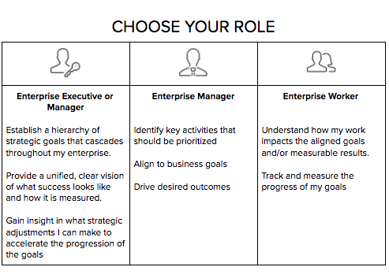

# Set up [!DNL Workfront Goals] for your company

*This section is for [!DNL Workfront] system administrators responsible for setting up Workfront Goals for their users.*

To guarantee your organization moves forward fast, you must be certain that work execution is aligned with company strategy. [!DNL Adobe Workfront Goals] coordinates strategy, goals, and work to drive execution across the organization and deliver measurable business outcomes.

Goal best practice starts with top-level corporate objectives and then cascades down to group, team, and individual levels. The resulting goals must be aligned with, contribute to, and support achieving corporate priorities. In [!DNL Workfront], goals are supported by results or activities that indicate how you achieve them.

## [!DNL Workfront Goals] checklist

The following conditions must be met before you can access [!DNL Adobe Workfront Goals]:

* Your organization must purchase a [!DNL Workfront Goals] license, in addition to the [!DNL Workfront] license.
* Your organization must be using the new [!DNL Workfront] experience interface. [!DNL Workfront Goals] is not available in the classic [!DNL Workfront] interface.
* Your [!DNL Workfront Goals] users must be given access to [!DNL Workfront Goals] in their access level.
* You must assign a layout template that includes the [!DNL Workfront Goals] area in the Main Menu for users to access the functionality.

## Who can use [!DNL Workfront Goals]

Although individual contributors often have personal goals, we recommend using [!DNL Workfront Goals] to support your organization's work in achieving strategic objectives. Everyone in the organization should be encouraged to set goals that are aligned to the overall company strategy and that connect with their daily activities.

Read the role descriptions below and determine what your role is in [!DNL Workfront Goals].

Executives and managers can use [!DNL Workfront Goals] to:

* Establish a hierarchy of strategic goals that cascades throughout the enterprise. 
* Provide a unified, clear vision of what success looks like and how it is measured.
* Gain insight in what strategic adjustments can be made to accelerate the progression of the goals.

Individual contributors can use [!DNL Workfront Goals] to:

* Align their goals to the overall company strategic initiatives.
* Measure their progress and achievement as it relates to strategic goals.
* Adjust personal goals as necessary to stay in alignment with business direction.

