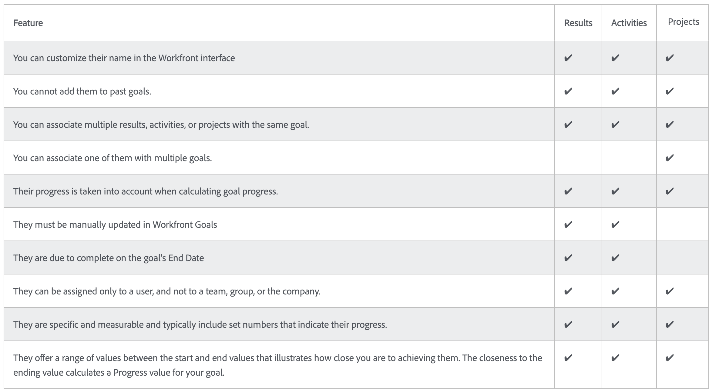

# Activate goals in [!DNL Workfront]

Now that you have created goals, let's activate them! When you create a goal, it's saved in [!UICONTROL Draft] status. [!UICONTROL Draft] goals are not a part of goal management until you activate them. Once activated, they switch to an [!UICONTROL Active] status and show progress in the dashboard and how they align to the overall strategy. Goals in [!UICONTROL Active] status are associated with a progress indicator—usually an activity or result or if the goal is aligned to another active goal (child-parent goal relationship).

## Progress indicators activate goals

Before moving on, it's important to understand the progress indicators used in [!DNL Workfront Goals]. Progress indicators are the objects in [!DNL Goals] used to calculate the progress of a goal. The progress indicators are aligned goals, results, activities, and projects. You’ll learn about these in more detail later. For now, it is important to understand that aligned goals, results, activities, and projects must be added to a goal in order to activate it.

Compared to other progress indicators, projects are a little unique, as they are considered a type of activity. Activities can be differentiated into two types—Manual progress bar and Projects. As a result, Projects also drive progress. Although all types of progress indicators can be connected to a parent goal, it’s important to keep in mind that there are differences in the way you manage them.

The following table displays similarities and differences between results, activities, and projects, as goal indicators:

