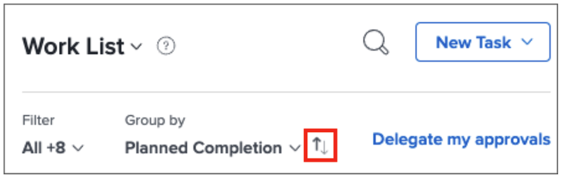

# Oganize your to-do list in [!DNL Workfront] [!UICONTROL Home]

>[!NOTE]
>
>The [!UICONTROL [!DNL Sort by]] option in the [!UICONTROL Work List] has been renamed to [!UICONTROL Group by], and tasks and issues can also be grouped by their [!UICONTROL Planned Start Date]. 

In this video, you will learn how to:

* Sort work assignments
* Filter work assignments by type
* Identify work that’s ready to start
* Accept work assignments

>[!VIDEO](https://video.tv.adobe.com/v/335099/?quality=12)

>[!NOTE]
>
>By default, earliest due items appear at the top of the [!UICONTROL Work List]. If you would like to have your work items appear in descending order, click the arrows to the right of the Group by area.

