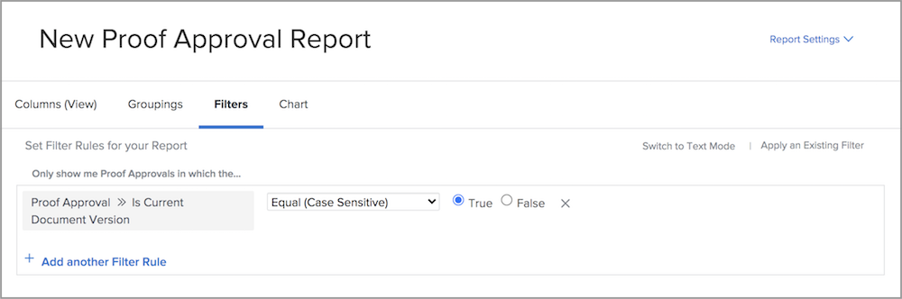
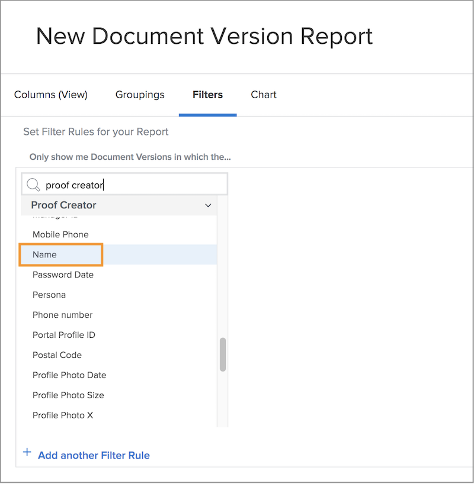

# Report on proofs

[!DNL Workfront]’s digital proofing features allow you to manage projects and related review workflows all in one place — [!DNL Workfront]. Gain valuable insight into the proofing work being done with report types, field sources, and field names that display review and approval information.

We recommend working with your [!DNL Workfront] consultant to create reports that meet your organization’s requirements. Some of the reports require familiarity with [!DNL Workfront]’s text mode reporting.

Start with these basic, standard reports to help your teams manage proofs going through a review and approval process in [!DNL Workfront].

## [!UICONTROL Proof Approval]

This report type helps you track outstanding proof approvals to make sure deadlines are being met.

![Select [!UICONTROL Proof Approval] from the [!UICONTROL New Report] drop-down menu](assets/proof-system-setups-proof-approval-report.png)

View and filter options include [!UICONTROL decision date], [!UICONTROL proof approval], [!UICONTROL approver stage], [!UICONTROL workflow template], and [!UICONTROL requester information]. With text mode reporting, you can create a grouping that organizes the list by document name.

When writing proof approval reports, make sure you’re getting information related to the most current version of the proofs. [!DNL Workfront] recommends including this field source and field name in the filter:

**[!UICONTROL Proof Approval]>>[!UICONTROL Is Current Document Version]**

This is useful when you’re reporting on proofs that have multiple versions so the report lists only the current version of each proof that needs approval. This filters out the earlier versions that you no longer need to work on.

## [!UICONTROL Document Version]

This report type allows you to manage and track versions in [!DNL Workfront].

![Select [!UICONTROL Document Version] from the [!UICONTROL New Report] drop-down menu](assets/proof-system-setups-document-version-report.png)

View options include information from the [!UICONTROL document version], [!UICONTROL document], [!UICONTROL entered by], [!UICONTROL proof approval status], [!UICONTROL proof creator], and [!UICONTROL document provider].

Groupings can be done by [!UICONTROL document version], [!UICONTROL entered by], [!UICONTROL proof approval status], or proof owner information.

Filters include [!UICONTROL document version], [!UICONTROL access level], [!UICONTROL document], [!UICONTROL entered by], [!UICONTROL proof approval status], [!UICONTROL proof creator], and document provider information.

You can display the name of the proofing stage that is currently active for each document on the report with this column in a view:

**[!UICONTROL Document Versions] >> [!UICONTROL Active Proof Stages]**

If no stage is currently active, the column is blank.

This field source >> field name also is available as a filter in a report.

Use the [!UICONTROL Proof Creator] field source to report on information about the user who created the proof. Choose the [!UICONTROL Name] field source to display the name of the proof creator in a view.

**[!UICONTROL Proof Creator] >> [!UICONTROL Name]**

This field source >> field name combo also is available as a filter.

<!--
Learn More Icon
Learn how to create reports in [!DNL Workfront] with the Report Creation class.
Access to proofing functionality
-->
