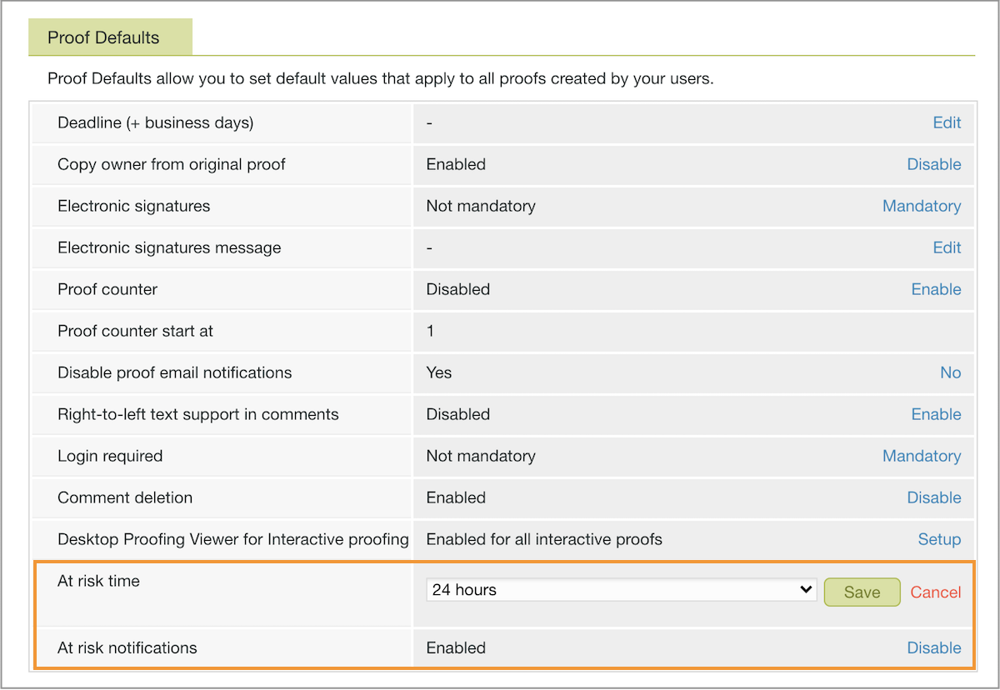

# Set default at risk proof settings

You’ll want to establish settings for at risk notifications that [!DNL Workfront] sends out. These are a gentle reminder about the upcoming proof deadline to the proof owner and approvers who haven’t made a decision yet.

The at risk notification is on by default, a proof is considered “at risk” 24 hours before the proof deadline. [!DNL Workfront] recommends leaving this notification turned on with the 24-hour timeframe. However, if the proof turnaround time at your organization is hours instead of days, you may want to shorten this up to just a few hours.

1. Select **[!UICONTROL Proofing]** from [!DNL Workfront’s] [!UICONTROL Main Menu].
1. Select **[!UICONTROL Account Settings]** in the top navigation bar.
1. Select the **[!UICONTROL Settings]** tab.
1. Go to the [!UICONTROL Proof Defaults] section.
1. In the [!UICONTROL At risk time] field, select **[!UICONTROL Setup]**. Then choose the number of hours before a proof deadline that the notification should be sent.
1. Select **[!UICONTROL Save]** for that setting.
1. Make sure it says [!UICONTROL Enabled] in the [!UICONTROL At risk notifications] field. If not, click the link to turn on the setting.

<!--
Lean More URLs
-->
