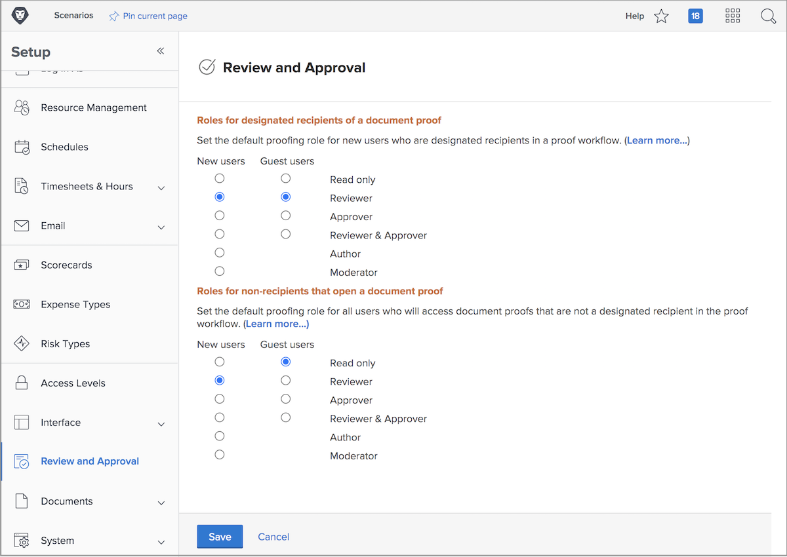

# Set default proof roles

<!---
21.4 updates have been made
--->

The first default setting to complete is determining a default proof role that will be assigned when new users are created or people open a proof.

Proof roles determine what a user is able to do with a proof—just look at it, make comments, approve it, etc. [!DNL Workfront] recommends that proof role defaults be set for all users, to make adding recipients to proofs and setting up workflows quicker and easier.

However, this default proof role can be changed as individual proofs are uploaded, ensuring everyone is able to fulfill the role required of them in the review and approval process.

## Set default proof roles

1. Select **Setup** from the [!UICONTROL Main Menu].
1. Select **Review & Approval** from the left menu.
1. Click the button next to the desired default proof role for both new [!DNL Workfront] users and guest proof users for “designated recipients” — anyone who is added to the proof workflow, either manually or through a workflow template.
1. Click the button next to the desired default proof role for both new [!DNL Workfront] users and guest proof users for “non-recipient” users. These are generally [!DNL Workfront] users who have access to a proof but aren’t one of the people assigned to the workflow.
1. Save the changes.

Consider what most of your users and guests will be expected to do when they are added to a proofing workflow. This should be your default.
